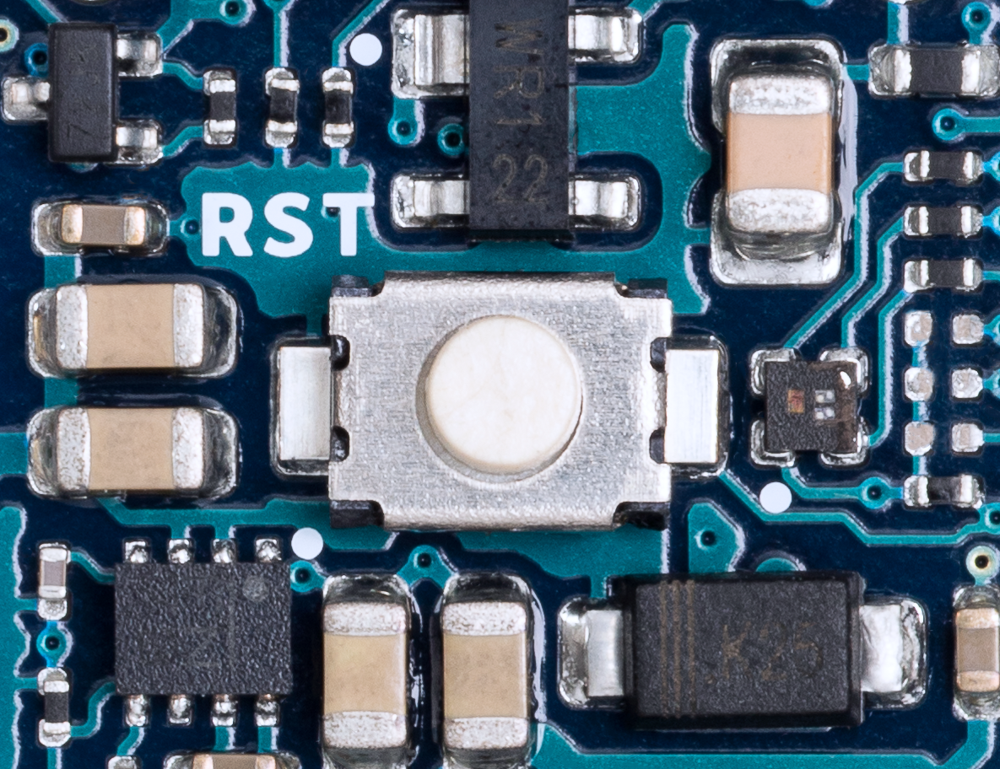
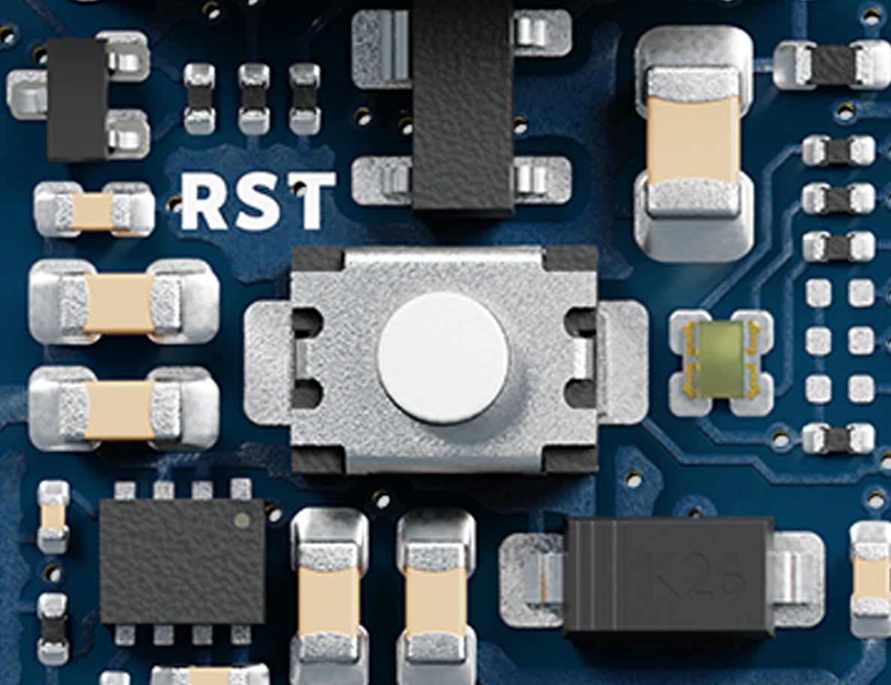

Arduino has determined that a limited number of Arduino Nano ESP32 boards were assembled with an RGB LED which has the green and blue pins inverted.

The inverted pins will result in the following behavior:

* The predefined `LED_GREEN` constant will have the **blue** LED pin number.
* The predefined `LED_BLUE` constant will have the **green** LED pin number.
* The RGB LED will be **blue** instead of green when the board is in recovery mode.
* The RGB LED will be **yellow** instead of purple when the board is in bootloader mode.

---

## Identify which RGB LED is on your board

It is possible to determine the type of RGB LED by visually inspecting the board:

1. Find the white reset button on the top of the board.
2. Hold the board so that the USB port is facing upward, and the RST label facing the right way.
3. Locate the RGB LED just right of the reset button.
4. Look closely at the RGB LED component:
   * If it has a black color, **it does not** have swapped green and blue pins.
   * If it has a gray/green color, **it has** swapped green and blue pins.

<div style="display: flex; flex-direction: row; flex-wrap: wrap;">
  <figure style="text-align: center;">
     
    <figcaption style="font-style: italic;">
      RGB LED with inverted green and blue pins.<br>
      (Part number: SMLP34RGB2W3)
    </figcaption>
  </figure>
  <figure style="text-align: center;">
     
    <figcaption style="font-style: italic;">
      RGB LED with regular green and blue pins.<br>
      (Part number: UHD1110-FKACL1A13R3Q1BBQFMF3)
    </figcaption>
  </figure>
</div>

---

## Using the RGB LED with inverted green and blue pins

### Referencing the pins directly

When writing to the RGB LED pins, use `16` for green, and `15` for blue.

Set the RGB LED to **green**:

```arduino
digitalWrite(14, HIGH); // Red OFF
digitalWrite(16, LOW);  // Green ON
digitalWrite(15, HIGH); // Blue OFF
```

Set the RGB LED to **blue**:

```arduino
digitalWrite(14, HIGH); // Red OFF
digitalWrite(16, HIGH); // Green OFF
digitalWrite(15, LOW);  // Blue ON
```

### Declaring your own constants

For convenience, you can declare your own constants in sketches where you use the RGB LED:

```arduino
const uint8_t MY_LED_RED   = 14;
const uint8_t MY_LED_GREEN = 16;
const uint8_t MY_LED_BLUE  = 15;
```

Set the RGB LED to **purple** with the above constants:

```arduino
digitalWrite(MY_LED_RED, LOW); // Red ON
digitalWrite(MY_LED_GREEN, HIGH); // Green OFF
digitalWrite(MY_LED_BLUE, LOW);  // Blue ON
```

### Correcting the predefined constants by editing `io_pin_remap.cpp`

If you're comfortable editing files inside the board core, you can change a few lines so that the `LED_GREEN` and `LED_BLUE` constants have the correct values.

Follow these steps:

1. Open the Arduino 15 folder<sup>[(?)](https://support.arduino.cc/hc/en-us/articles/360018448279-Open-the-Arduino15-folder)</sup>.
2. Navigate to `packages/arduino/hardware/esp32/<version>`.
3. Open `io_pin_remap.cpp` in a text editor.
4. Find the following lines:

   ```cpp
   [LED_RED]   = 46,
   [LED_GREEN] = 0,
   [LED_BLUE]  = 45, // RTS
   ```

5. Edit them so they look like this:

   ```cpp
   [LED_RED]   = 46,
   [LED_GREEN] = 45, // RTS
   [LED_BLUE]  = 0,
   ```

6. Save the changes to `io_pin_remap.cpp`.

To preserve hardware flow control on the serial port, also make this change in `pins_arduino.h`:

1. Inside the same folder as  before, open `pins_arduino.h`.

2. Find the line

   ```
   static constexpr uint8_t RTS  = LED_BLUE;
   ```

   and change it to

   ```
   static constexpr uint8_t RTS  = LED_GREEN;
   ```

3. Save the changes to `pins_arduino.h`.

Note that the changes will be overwritten if you update or change the esp32 board package version.
