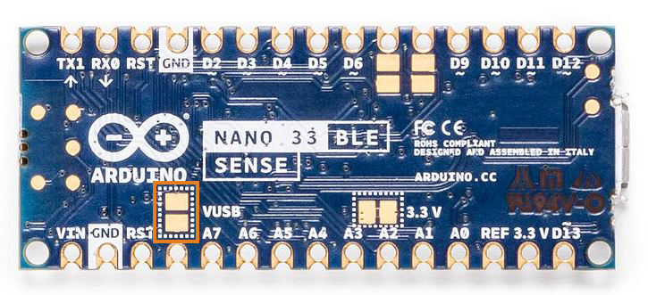

## Why the 5 V pin is disabled

The following boards operate at 3.3 V, and have the 5 V pin (D12) disabled out of the box:

- [Arduino Nano 33 BLE](https://store.arduino.cc/products/arduino-nano-33-ble)
- [Arduino Nano 33 BLE Sense](https://store.arduino.cc/products/arduino-nano-33-ble-sense)
- [Arduino Nano 33 IoT](https://store.arduino.cc/products/arduino-nano-33-iot)
- [Arduino Nano RP2040 Connect](https://store.arduino.cc/products/arduino-nano-rp2040-connect)

This is a safety precaution, as **connecting higher voltage signals to the board can damage the hardware**.

---

## Enabling the 5 V pin

The 5 V pin will be enabled if:

- The pads marked VUSB are shorted.
- The board is powered by a USB connection.

The VUSB is located on the bottom of the board. The pads on the Nano 33 BLE Sense are highlighted below.

