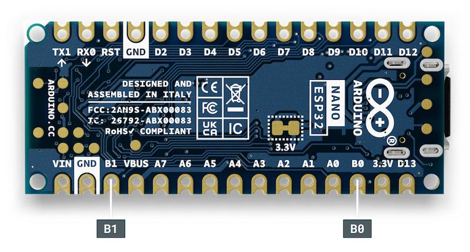

The **B1** and **B0** pins on the Arduino Nano ESP32 expose two of the strapping pins[^strapping-pins] on the Espressif ESP32-S3 module.

---

## Overview of the pins

**B1 pin:**

* By shorting B1 to GND, and pressing the reset button, the board will enter **bootloader mode**. This is necessary for flashing the firmware, and can also be useful for recovering the board from an unresponsive state.
* To upload a sketch in Arduino IDE when the board is bootloader mode, select **Sketch > Upload Using Programmer**.
* When B1 is shorted to GND, the onboard RGB LED will turn green[^swapped-leds].
* Connects to GPIO0 on the ESP32-S3.

[^swapped-leds]: On some Nano ESP32, the green and blue pins are inverted. See [About Nano ESP32 boards with inverted green and blue pins](https://support.arduino.cc/hc/en-us/articles/9589073738012).

**B0 pin:**

* Without additional configuration, it does nothing by itself.
* In combination with B1, B0 can cause unexpected behavior by the CPU at reset.
* When B0 is shorted to GND, the onboard RGB LED will turn red.
* Connects to GPIO46 on the ESP32-S3.

---

## Using the pins in sketches

Except for the bootloader reset procedure, the B1 and B0 pins are recommended to use only for outputs to avoid unexpected behavior when resetting the board.

[^strapping-pins]: [ESP32-S3 Series Datasheet – 2.6 Strapping Pins](https://www.espressif.com/sites/default/files/documentation/esp32-s3_datasheet_en.pdf#page=23)
