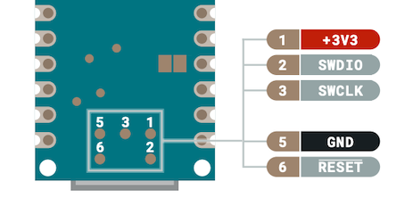

> **Note:** The method described here are for advanced users, and requires specialized equipment.

Learn about the ways to burn the bootloader on the Arduino Nano 33 IoT.

In this article:

* [Connecting to the test points on the Nano 33 IoT](#connecting-to-the-test-points)
* [Burn the bootloader with a debugger](#debugger)
* [Burn the bootloader using another Arduino board as a programmer](#sd-card)

---

<a id="connecting-to-the-test-points"></a>

## Connecting to the test points on the Nano 33 IoT

> **Note:** Improper soldering can void the warranty. [Contact us](https://www.arduino.cc/en/contact-us/) before soldering if your board is under warranty.

To burn the bootloader on Arduino Nano 33 IoT, we need to use the **SWD (Serial Wire Debug)** interface. On the Nano 33 IoT, the two main pins for this interface (SWDIO/SWCLK) is available via test points on the bottom of the board, near the Arduino logo:



You'll need a way to connect your programmer to these points (also called "pads"), such as:

* A 0.1" pitch 2x3 Pogo adapter.
* Soldering wire to the pads. If you use this method, you can use the header pins for **+3V3**, **GND**, and **RST**.

---

<a id="debugger"></a>

## Burn the bootloader with a debugger

### What you'll need

* **A debugging probe** that is CMSIS-DAP compliant and that supports Serial Wire Debug, like this [open source debugger (US only)](https://www.tindie.com/products/ataradov/cmsis-dap-compliant-swd-debugger/).
* Many debug probes use a 2x5 0.05" pitch header/cable. You may need a breakout board, like [this one from Adafruit](https://www.adafruit.com/product/2743).
* A way to connect your programmer to your Nano 33 IoT board. See [Connecting to the test points on the Nano 33 IoT](#connecting-to-the-test-points).

### Instructions

1. Connect the programmer to the SWD pads on the target Nano 33 IoT board:

   | Programmer | Target (Nano 33 IoT)            |
   |------------|---------------------------------|
   | VTref      | +3.3V (pad) / 3.3V (header pin) |
   | SWDIO      | SWDIO (pad)                     |
   | SWCLK      | SWCLK (pad)                     |
   | GND        | GND (pad) / GND (header pin)    |
   | RESET      | RST (pad) / RST (header pin)    |

1. Connect the programmer to your computer.

1. Power the Nano 33 IoT by connecting it to your computer with a USB cable (the connections in the previous step do not power the board).

1. Open Arduino IDE.

1. Select **Arduino Nano 33 IoT** in the board selector or the **Tools > Board** menu.

1. Select **Tools > Programmer > Atmel EDBG**.

1. Select **Tools > Burn Bootloader** to burn the bootloader.

1. Monitor the progress in the console window. A successful operation will end with this output:

   ```
   ** Programming Finished **
   ** Verify Started **
   verified 6400 bytes in 0.544474s (11.479 KiB/s)
   ** Verified OK **
   ** Resetting Target **
   shutdown command invoked
   ```

---

<a id="sd-card"></a>

## Burn the bootloader using another Arduino board as a programmer

### What you'll need

* An extra Arduino board that runs at 3.3 V to use as the programmer.
  * **Note:** certain Arduino boards can't be used with the sketch that converts it to a programmer.
    * **Working:** SAMD architecture boards (e.g., MKR boards, Nano 33 IoT, Zero).
    * **Untested:** AVR architecture boards (e.g., Mega), but the sketch does compile for them.
    * **Not working:** Nano 33 BLE
  * It is possible to use an Arduino board that runs at 5 V as the programmer, but you'll need to use level shifting circuitry on the programming lines to avoid exposing the target board to 5 V logic levels, which would damage it.
* An SD slot for the programmer board, such as:
  * A built-in SD slot , like on the [Arduino MKR Zero](https://store.arduino.cc/products/arduino-mkr-zero-i2s-bus-sd-for-sound-music-digital-audio-data).
  * A compatible SD card shield, like the [MKR SD Proto Shield](https://store.arduino.cc/products/mkr-sd-proto-shield).
  * A common SD module.
* An SD card.
* A way to connect the SD card to your computer.
* A way to connect the programmer board to your Nano 33 IoT. See [Connecting to the test points on the Nano 33 IoT](#connecting-to-the-test-points).

### Instructions

1. [Download the bootloader binary](https://github.com/arduino/ArduinoCore-samd/raw/master/bootloaders/nano_33_iot/samd21_sam_ba_arduino_nano_33_iot.bin).

1. Rename the downloaded file to `fw.bin`.

1. Connect your SD card to your computer.

1. Move `fw.bin` to the SD card.

1. Eject the SD card from your computer.

1. Plug the USB cable of the Arduino board you will be using as a programmer into your computer.

1. Open Arduino IDE.

1. [Use the Library Manager](https://support.arduino.cc/hc/en-us/articles/5145457742236-Add-libraries-to-Arduino-IDE#library-manager) to install the **Adafruit DAP library** by Adafruit. If asked whether to install library dependencies, choose **Install all**.

1. When the library download is complete, select **File > Examples > Adafruit DAP library > samd21 > flash_from_SD** from the Arduino IDE's menus.

1. Prepare the sketch:

   * If you've using a connected SD module, either make sure that the **CS (Chip Select)** pin is connected to pin 4, or edit this line to match the actual connection:

     ```
     #define SD_CS 4
     ```

   * If your board has a built-in SD slot, then you can change this line:

     ```
     if (!SD.begin(SD_CS)) {
     ```

     to:

     ```
     if (!SD.begin()) {
     ```

1. Select the **programmer board** using the board selector or **Tools > Board** menu.

1. Ensure the **programmer board** is selected in the **Tools > Port** menu.

1. Click  **Upload** and wait until the sketch has uploaded successfully.

1. Unplug the programmer Arduino board from your computer.

1. Plug the SD card into the SD slot connected to your Arduino board.

1. Connect the programmer Arduino board to the target Arduino board as follows:

   | Programmer board | Target board (Nano 33 IoT)      |
   |------------------|---------------------------------|
   | VCC              | +3.3V (pad) / 3.3V (header pin) |
   | 10               | SWDIO (pad)                     |
   | 9                | SWCLK (pad)                     |
   | GND              | GND (pad) / GND (header pin)    |
   | 11               | RST (pad) / RST (header pin)    |

1. Plug the USB cable of the programmer Arduino board into your computer.

1. Select **Tools > Serial Monitor** to see the Serial Monitor output as the programmer board flashes the bootloader file.

1. Wait until the process finishes, then disconnect the programmer board.
