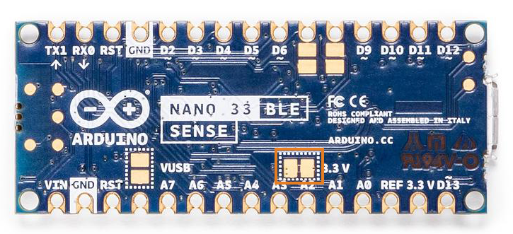

It is possible to power the board bypassing the DC-DC regulator cutting the link between the 3.3 V pads. Read below for a detailed explanation:

There are two connector plates or pads on the back of your Nano 33 BLE Sense. They are connected by a thin line of conductive material that can be cut with a sharp object if needed. By doing so, you isolate the voltage regulator circuit (DC/DC 5 V -> 3.3 V) which enhances this device’s performance by reducing considerably the power consumption and overheating.

This configuration is recommended for low power consumption projects on which the board will be inactive for long periods of time. While on this mod, the board shall be powered from its 3.3 V and GND input pins.

Please be aware that the board can't be programmed using the USB standard procedure while on this configuration. To recover this functionality you need to restore the connection between the two pads with a drop of solder. We therefore suggest that you cut the connection when you have finalized your sketch and the board has been programmed with the final version.
