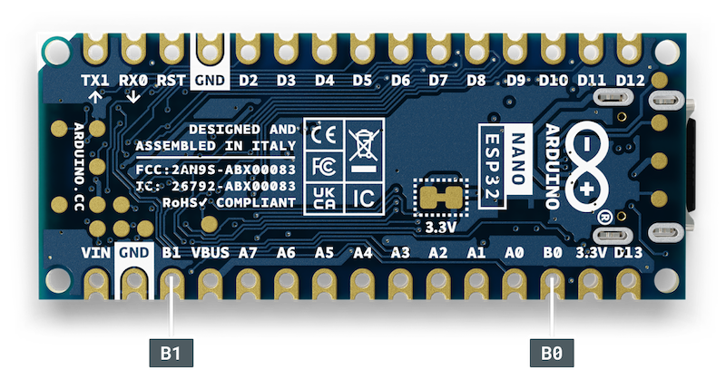

Some Nano boards that operate on 3.3 V power have a pin called **VUSB** or **VBUS**, that will output power directly from the USB connector. The pin will not receive any power if no power is being supplied to the USB port (such as when powering the board via a battery connected to **Vin**).

On all boards except the Nano ESP32, two pads must be shorted in order to enable the pin.

> **Warning:** Please note the following:
>
> * Do not short the VUSB or VBUS pin to any of the other pins on the board.
> * The power output on the VUSB or VBUS pin does not get regulated by the board. A USB connection will typically output 4.4 V to 5.50 V (higher voltages need to be requested by the device).

In this article:

* [Nano RP2040 Connect, Nano 33 IoT, and Nano 33 BLE boards](#rp2040-33)
* [Nano ESP32](#nano-esp32)

---

## Nano RP2040 Connect, Nano 33 IoT, and Nano 33 BLE boards

This section applies to the following boards:

* Arduino Nano 33 BLE
* Arduino Nano 33 BLE Sense
* Arduino Nano 33 BLE Sense Rev2
* Arduino Nano 33 IoT
* Arduino Nano RP2040 Connect

### Enabling the VUSB pin

To enable the VUSB pin there are two pads that must be connected. The pads are located on the bottom of the board, next to the VUSB pin:

### Using the VUSB pin

When the pads have been shorted, the VUSB pin outputs whatever power (if any) is available on the USB port.

> **Note:** The board operates on 3.3 V. Do not short the VUSB pin to any of the other pins on the board.

---

## Nano ESP32

This section applies to the following boards:

* Arduino Nano ESP32

### Enabling the VBUS pin

The VBUS pin is enabled by default.

### Using the VBUS pin

The VBUS pin outputs whatever power (if any) is available on the USB port.

> **Note:** The board operates on 3.3 V. Do not short the VBUS pin to any of the other pins on the board.
