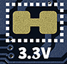
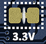

Some Nano boards have a trace that can be cut to bypass the step down converter, and enable powering the board directly with a 3.3 V external power source. This can provide greater power efficiency and reduced heat generation on the board, especially for applications when the board is running on battery power, and will be inactive for long periods of time.

---

## Before you begin

You can use this procedure with the following boards:

* Nano 33 BLE
* Nano 33 BLE Sense
* Nano 33 BLE Sense Rev2
* Nano ESP32
* Nano RP2040 Connect

Bypassing the onboard voltage regulator allows you to power the board directly with 3.3 V, adding the advantage of greater power efficiency and reduced heat generation on the board.

**Advantages:**

* Greater power efficiency.
* Reduced heat generation on the board.

**Disadvantages:**

* The power you supply in this configuration must be pre-regulated to 3.3 V.
* You can no longer use a USB connection to power the board.
* You can no longer use a USB connection to upload sketches.

This configuration is mainly recommended ready-to-deploy projects where low power consumption is a priority.

---

## Configure your board for 3.3 V power

> **Warning:** Cutting the 3.3V pads will disable the USB connector! You won't be able upload sketches or power the board using USB until you restore the connection between the pads.

1. Disconnect all power sources from your board.

2. Find the pads on the bottom of your board. They are outlined with a white, dotted line, and are labeled "3.3V".

   

3. Use a sharp object (such as a hobby knife) to cut the trace (thin line of material) connecting the two pads:

   

     <figure style="text-align: center;">
        
       <figcaption style="font-style: italic;">
         Before cutting the trace.
       </figcaption>
     </figure>
     <figure style="text-align: center;">
        
        <figcaption style="font-style: italic;">
          After cutting the trace.
        </figcaption>
     </figure>
   

4. Connect your regulated DC power source:

   * Connect your 3.3V+ power to the 3V3/3.3V pin.

   * Connect your power's ground to a GND pin.

<figure style="width: 800px; margin: 0;">
    
    <figcaption style="text-align: center; font-style: italic;">Example: Battery connected to Nano RP2040 Connect.</figcaption>
</figure>

---

## Restoring the default configuration

To restore the solder jumper and return the board to its default configuration, apply a small amount of solder to short the two 3.3V pads again.

---

## Further reading

You can find board schematics and full pinouts in Arduino Docs:

* [Nano 33 BLE](https://docs.arduino.cc/hardware/nano-33-ble)
* [Nano 33 BLE Sense](https://docs.arduino.cc/hardware/nano-33-ble-sense)
* [Nano 33 BLE Sense Rev2](https://docs.arduino.cc/hardware/nano-33-ble-sense-rev2)
* [Nano ESP32](https://docs.arduino.cc/hardware/nano-esp32)
* [Nano RP2040 Connect](https://docs.arduino.cc/hardware/nano-rp2040-connect)
