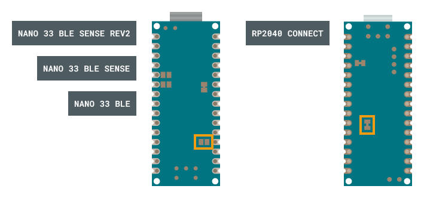

Some Nano boards have an exposed solder jumper that can be cut to enable powering the board directly with 3.3 V external power source.

---

## Overview

### Supported boards

You can use this procedure with the following boards:

* Nano 33 BLE
* Nano 33 BLE Sense
* Nano 33 BLE Sense Rev2
* Nano RP2040 Connect

### Purpose and considerations

Bypassing the onboard voltage regulator allows you to power the board directly with 3.3 V, adding the advantage of greater power efficiency and reduced heat generation on the board

However, you should note the following:

* The power you supply in this configuration must be pre-regulated.
* You can no longer use USB power the board or upload sketches.

Consequently, this configuration is mainly recommended for reducing power consumption for ready-to-deploy projects in which the board will be inactive for long periods of time.

---

## Configure your board with 3.3 V power

> **Note:** Sketches can not be uploaded via USB in this configuration!

1. Disconnect all power sources from your board.

2. Identify the two 3.3V pads on the back of your board:

   

3. Cut the thin line of solder between the pads with a sharp object.

4. **Connect your regulated DC power source:**

   * Connect your 3.3V+ power to the 3.3 V pin.

   * Connect your power's ground a GND pin.

   

---

## Restoring the default configuration

To restore the solder jumper and return the board to its default configuration, apply a small amount of solder to short the two 3.3V pads.

---

## Further reading

You can find board schematics and full pinouts in Arduino Docs:

* [Nano 33 BLE](https://docs.arduino.cc/hardware/nano-33-ble)
* [Nano 33 BLE Sense](https://docs.arduino.cc/hardware/nano-33-ble-sense)
* [Nano 33 BLE Sense Rev2](https://docs.arduino.cc/hardware/nano-33-ble-sense-rev2)
* [Nano RP2040 Connect](https://docs.arduino.cc/hardware/nano-rp2040-connect)
