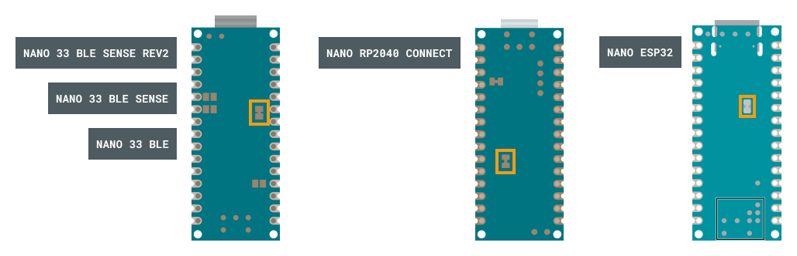
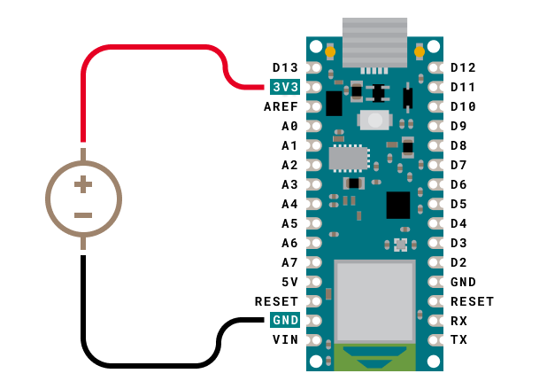

Some Nano boards have an exposed solder jumper that can be cut to enable powering the board directly with a 3.3 V external power source.

---

## Overview

### Supported boards

You can use this procedure with the following boards:

* Nano 33 BLE
* Nano 33 BLE Sense
* Nano 33 BLE Sense Rev2
* Nano ESP32
* Nano RP2040 Connect

### Purpose and considerations

Bypassing the onboard voltage regulator allows you to power the board directly with 3.3 V, adding the advantage of greater power efficiency and reduced heat generation on the board

However, please note:

* The power you supply in this configuration must be pre-regulated.
* You can no longer use USB to power the board or upload sketches.

Consequently, this configuration is mainly recommended for reducing power consumption for ready-to-deploy projects in which the board will be inactive for long periods of time.

---

## Configure your board with 3.3 V power

> **Note:** Cutting the 3.3V pads will disable the USB connector!

1. Disconnect all power sources from your board.

2. Find the pads on the bottom of your board. They are outlined with a white, dotted line, and are labeled "3.3V".

   

3. Use a sharp object to cut the thin line of material connecting the two pads:

4. Connect your regulated DC power source:

   * Connect your 3.3V+ power to the 3V3/3.3V pin.

   * Connect your power's ground to a GND pin.

<figure style="width: 800px; margin: 0;">
    
    <figcaption style="text-align: center; font-style: italic;">Example: Battery connected to Nano RP2040 Connect.</figcaption>
</figure>

---

## Restoring the default configuration

To restore the solder jumper and return the board to its default configuration, apply a small amount of solder to short the two 3.3V pads.

---

## Further reading

You can find board schematics and full pinouts in Arduino Docs:

* [Nano 33 BLE](https://docs.arduino.cc/hardware/nano-33-ble)
* [Nano 33 BLE Sense](https://docs.arduino.cc/hardware/nano-33-ble-sense)
* [Nano 33 BLE Sense Rev2](https://docs.arduino.cc/hardware/nano-33-ble-sense-rev2)
* [Nano ESP32](https://docs.arduino.cc/hardware/nano-esp32)
* [Nano RP2040 Connect](https://docs.arduino.cc/hardware/nano-rp2040-connect)
