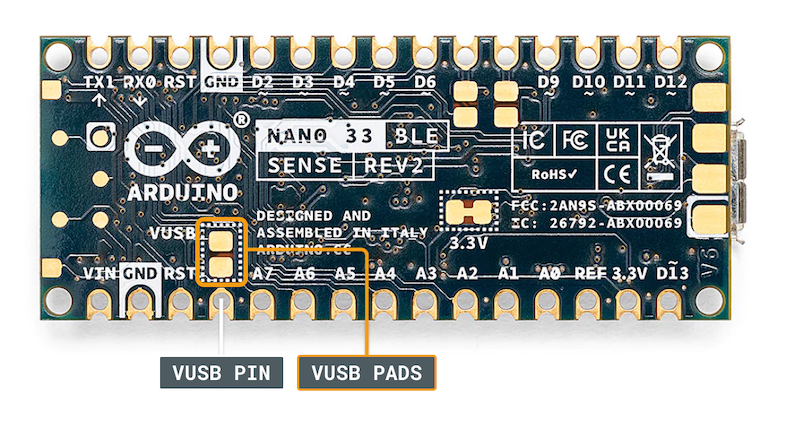
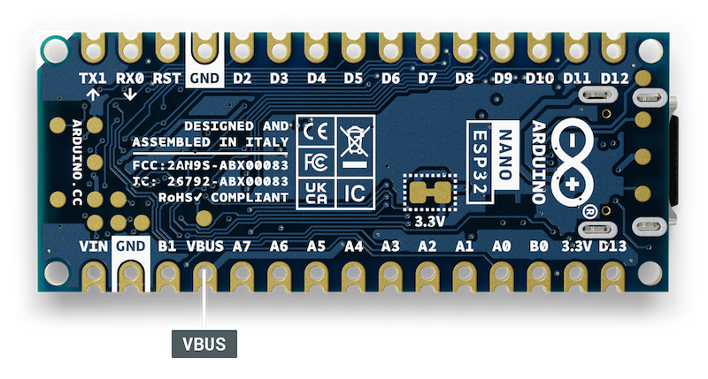

The Nano Family is a series of boards with the same form factor and pin layout. This standardized form factor makes it easier for makers and third-party manufacturers to design hardware accessories compatible with the wide range of Nano boards.

Despite the similarities, there are subtle differences in some Nano boards in order to support their unique functionalities. In this article:

* [Pinout differences](#pinout-differences)
* [Operating voltage differences](#operating-voltage-differences)
* [Other differences](#other-differences)

 ---

## Pinout differences

The table below presents an overview of the pinout differences:

<table>
  <tr>
    <th>Board</th>
    <th>Analog Header Reset</th>
    <th>AREF</th>
    <th>5V</th>
  </tr>
  <tr>
    <td>Nano</td>
    <td>RST</td>
    <td>AREF</td>
    <td>5V</td>
  </tr>
  <tr>
    <td>Nano Every</td>
    <td>RST</td>
    <td>AREF</td>
    <td>5V</td>
  </tr>
  <tr>
    <td>Nano 33 BLE</td>
    <td>RST</td>
    <td>AREF</td>
    <td>VUSB</td>
  </tr>
  <tr>
    <td>Nano 33 BLE Sense</td>
    <td>RST</td>
    <td>AREF</td>
    <td>VUSB</td>
  </tr>
  <tr>
    <td>Nano 33 BLE Sense Rev2</td>
    <td>RST</td>
    <td>AREF</td>
    <td>VUSB</td>
  </tr>
  <tr>
    <td>Nano 33 IoT</td>
    <td>RST</td>
    <td>AREF</td>
    <td>VUSB</td>
  </tr>
  <tr>
    <td>Nano RP2040 Connect</td>
    <td>REC</td>
    <td>AREF</td>
    <td>VUSB</td>
  </tr>
  <tr>
    <td>Nano ESP32</td>
    <td>B1 (Boot 1)</td>
    <td>B0 (Boot 0)</td>
    <td>VBUS</td>
  </tr>
</table>

Understanding the pinout differences is crucial for those designing custom hardware or using third-party accessories for the Nano form factor. For example:

* An accessory created for the Nano Every might not work correctly with the Nano ESP32. In this case, it would lead to problems when powering up the board since the RST pin on the Nano Every corresponds to the B1 (BOOT1) pin on the Nano ESP32.

---

## Operating voltage differences

The boards in the Nano Family operate at different voltages:

**Boards that operate at 5 V:**

* Arduino Nano
* Arduino Nano Every

**Boards that operate on 3.3 V:**

* Arduino Nano 33 BLE
* Arduino Nano 33 BLE Sense
* Arduino Nano 33 BLE Sense Rev2
* Arduino Nano 33 IoT
* Arduino Nano RP2040 Connect
* Arduino Nano ESP32

---

## Other differences

Besides the pinout layout, there are other visual differences in the Nano Family boards.

### VUSB pads

It is possible to [enable 5 V power on the VUSB or VBUS pin on Nano boards](https://support.arduino.cc/hc/en-us/articles/360014779679-Enable-5-V-power-on-the-VUSB-or-VBUS-pin-on-Nano-boards) that operate on 3.3V. On all of these boards (except the Nano ESP32), two VUSB pads must be shorted in order to enable the VUSB pin. On the Nano ESP 32, the VBUS pin is enabled by default and these two pads are not present.

<table>
  <tr>
    <td></td>
    <td></td>
  </tr>
</table>

### I2C pads

The Nano 33 BLE, the Nano 33 BLE Sense, and Nano 33 BLE Sense Rev2 have two unnamed pads on the back of the board:

These exposed pads can be used for installing pull-up resistors when using the I2C protocol. <a class="link-chevron-right" href="https://support.arduino.cc/hc/en-us/articles/11153357842588-I2C-and-pull-up-resistors">Read more about I2C and pull-up resistors</a>
