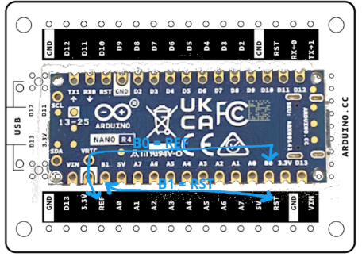

The [Arduino Nano Screw Terminal Adapter](https://store.arduino.cc/nano-screw-terminal-adapter) allows you to easily connect Arduino Nano boards to external sensors, actuators, and other components using screw terminals.

While the adapter is compatible with all boards in the Nano family, it was originally designed for the classic Nano pinout. Because of this, the silk-screen labels on the adapter may differ from the actual pin names and functions on newer boards, such as the **Arduino Nano R4** and **Arduino Nano ESP32**.

---

## Arduino Nano R4

On the Arduino Nano R4, the pins located at the **REF** and **RST** positions on the screw terminal adapter are labeled **B0** and **B1** on the board itself:

| Board pin | Adapter label |
| :-------- | :------------ |
|     B0    |      REF      |
|     B1    |      RST      |

---

## Arduino Nano ESP32

The Arduino Nano ESP32 has several pins with labels that differ from the silk-screen markings on the screw terminal adapter:

| Board pin | Adapter label |
| :-------- | :------------ |
|     B0    |     REF       |
|     VBUS  |     5V        |
|     B1    |     RST       |

> [!NOTE]
> On the Nano ESP32, the **B1** and **B0** pins are strapping pins used for the bootloader. For more information, see [About the B1 and B0 pins on the Nano ESP32](https://support.arduino.cc/hc/en-us/articles/9625819325212).
