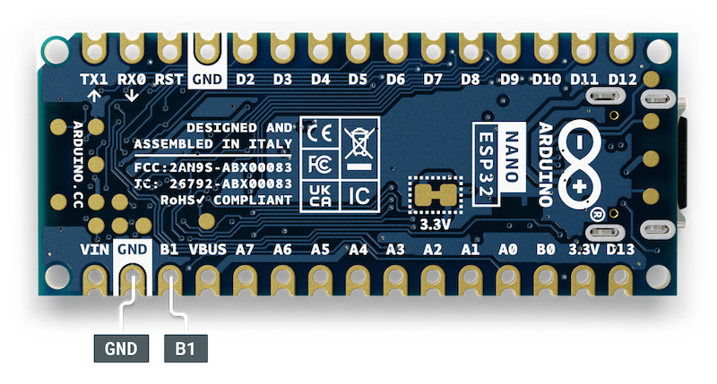
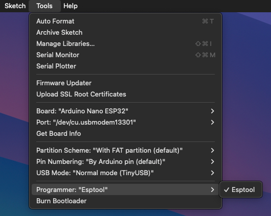

Learn how to reset the default Arduino bootloader on the Nano ESP32 using Arduino IDE.

These are some reasons you may want to reset the bootloader:

* Update the Arduino bootloader already on the board. This can resolve issues with Nano ESP32 being misidentified as other ESP32 boards.
* Restore the ability to upload regular Arduino sketches to a Nano ESP32 that has been flashed with the MicroPython firmware.

In this article:

* [Option 1: Using the bootloader mode](#bootloader-mode)
* [Option 2: Use the Esptool programmer option](#esp32-download-mode)

> [!TIP]
> Before you begin, it is recommended to have the latest version of the **Arduino ESP32 Boards** or **esp32** boards package installed using the Board Manager.

---

## Option 1: Using bootloader mode {#bootloader-mode}

The quickest way to reset your Arduino Nano ESP32 is by activating the bootloader mode.

Follow these steps:

1. Press the RST button two times, waiting 0.3 to 1 second between each press.

   > [!IMPORTANT]
   > The timing between presses is different compared to bootloader mode on most other Arduino boards. If bootloader mode won’t activate, try adjusting your timing.

2. Check the on-board LED near the RST button:
   * **If the LED pulses slowly in green[^colors]:** The board is in bootloader mode. Go to the next step.
   * **If the LED is off:** Repeat step 1 or try [Option 2: Use the Esptool programmer option](#esp32-download-mode).
3. Select Arduino Nano ESP32 in Arduino IDE or the Cloud Editor.
4. Upload any sketch to restore the standard Arduino bootloader.

---

## Option 2: Use the Esptool programmer option {#esp32-download-mode}

Follow these steps:

1. Connect a jumper cable between the **GND** and **B1** pins. The RGB LED will turn on with a green[^colors] color.

   

2. While the **GND** and **B1** pins are shorted, press the white **RST** button on the top of the board to reset the board to **firmware download mode**.

3. Remove the jumper cable. The RGB LED should stay on, in a purple[^colors] color.

4. Open Arduino IDE.

5. Go to **Tools > Port** and select the board (it may be identified as an arbitrary ESP32 board).

6. Go to **Tools > Board** and select **Arduino ESP32 Boards > Arduino Nano ESP32** (or **esp32 > Arduino Nano ESP32** if you're using the full esp32 package).

7. Open the **Tools > Programmer** menu.

8. Click on the **Esptool** option to select it.

9. Select **Sketch > Upload Using Programmer** to begin uploading the firmware.

   The process is complete when you see these lines:

   ```
   Leaving...
   Hard resetting via RTS pin...
   ```

10. Press the **RST** button on top of the board to exit firmware download mode.

### Troubleshooting

#### dfu-util: No DFU capable USB device available

If you see this error, it means that the sketch is still being uploading with the regular upload process.

Try this:

* Ensure that the **Esptool** option is selected in the **Sketch > Upload Using Programmer** menu. It needs to be actively selected, even if no other options are available. You will know the Esptool option is selected if a checkmark is displayed next to the name.

  

* Ensure you are uploading the sketch by selecting **Sketch > Upload Using Programmer** and not by clicking the regular Upload button.

[^colors]: On some earlier versions of the Nano ESP32, the LED will be blue instead of green, and yellow instead of purple.
