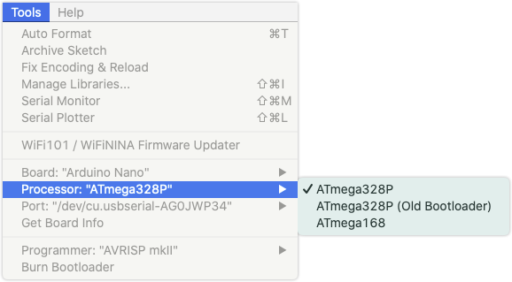
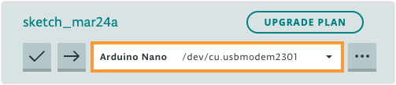
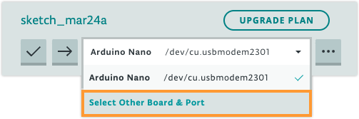
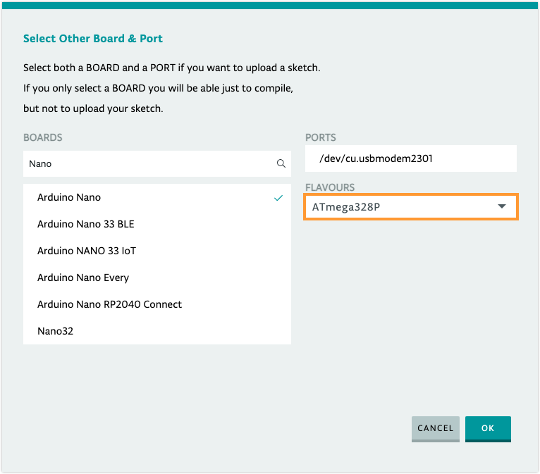

When [Arduino Nano](https://docs.arduino.cc/hardware/nano) is selected in Arduino IDE or the Arduino Cloud Editor, you will have an additional option to specify the processor on the board. You may need to change this setting if you're using an older Arduino Nano or a third-party Nano board.

---

## About the processor options

> Original Arduino Nano boards use the ATmega328P microcontroller, but those sold in 2018 or later come with an updated bootloader. For this reason, the **Arduino AVR Boards** package has **two** versions of ATmega328P available (v1.16.21 and later).

Three processor options are available:

* _ATmega328P_. Use this for Arduino Nano boards purchased in 2018 or later. This option is selected by default.
* _ATmega328P (Old Bootloader)_. Use this if your Nano was purchased before 2018.
* _ATmega168_. Used by some third-party Nano boards.

If you don't know which bootloader or processor is on your board, you can test them one by one by uploading a sketch. If the wrong processor is selected, Arduino IDE will be unable to communicate with the bootloader, and the upload will fail.

---

## Select processor in Arduino IDE

1. In the menu bar, select _Tools > Board > Arduino AVR Boards > Arduino Nano_.

2. Open the _Tools_ menu again, and find the _Processor_ row. The current selection will be displayed.

3. Put your mouse cursor over the _Processor_ row to reveal the options.

   

4. Click on one of the options to change the selection.

---

## Select processor in the Cloud Editor

1. Click the "board & port" selection menu.

   

2. Click **Select Other Board & Port**.

   

3. Under "BOARDS", make sure Arduino Nano is the selected board.

4. When Arduino Nano is selected, a **FLAVOURS** selection menu will appear:

   

5. Click on one of the options to change the selection.

6. Click **OK** to close.

<!-- NOTE: We have updated the NANO board with a fresh bootloader. Boards sold from us from January 2018 have this new bootloader, while boards manufactured before that date have the old bootloader. First, make sure you have the Arduino AVR Core 1.16.21 or later looking at the Board Manager. Then, to program the NEW Arduino NANO boards you need to chose Processor > "ATmega328P". To program old boards you need to choose Processor > "ATmega328P (Old Bootloader)". If you get an error while uploading or you are not sure which bootloader you have, try each type of processor 328P until your board gets properly programmed. (https://web.archive.org/web/20181124233032/https://www.arduino.cc/en/Guide/ArduinoNano) -->
