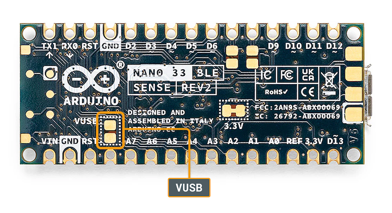
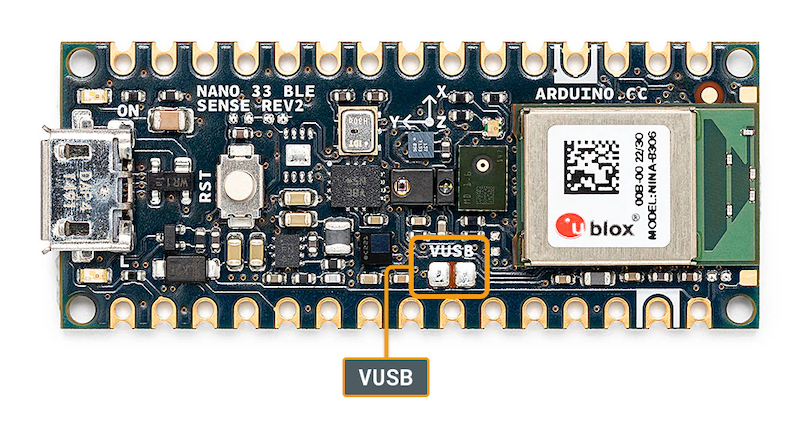

Many Arduino Nano boards are powered by 3.3 V but include a dedicated pin—labeled VUSB, VBUS, or 5V—that can output power from the USB port. This pin provides direct access to the 5 V line coming from the USB connection and can be used to power external components such as sensors, modules, or LEDs, while the board itself continues running at 3.3 V.

In this article:

- [Before you begin](#before-you-begin)
- [Requirements for supported boards](#requirements-for-supported-boards)
- [Solder VUSB jumper pads if required](#solder-vusb-jumper-pads)

---

## Before you begin

> [!WARNING]
> Do not connect the VUSB/VBUS/5V pin to any of the other pins on the board.

- The VUSB/VBUS/5V pin outputs power directly from the USB connector when enabled.
- Power from the USB supply can range from 4.4 V to 5.5 V, per USB specifications.
- Do not connect the VUSB/VBUS/5V pin to any of the other pins on the board. Supplying 5 V to other pins can permanently damage the board.

---

## Requirements for supported boards

There are two main requirements for using the "VUSB" pin:

- The board must be powered via USB. If you power the board through other means—such as a battery connected to Vin or a 3.3 V supply—the pin will not output anything.
- On some boards, the VUSB line must be enabled by connecting a pair of jumper pads.

The table below summarizes which Nano boards support 5 V output, what the output pin is called, and whether any action is required to enable it.

| Board                          | 5 V output pin | How to enable                                                    |
|:-------------------------------|:---------------|:-----------------------------------------------------------------|
| Arduino Nano 33 BLE            | VUSB           | [Enable by soldering VUSB jumper pads](#solder-vusb-jumper-pads) |
| Arduino Nano 33 BLE Rev2       | VUSB           | [Enable by soldering VUSB jumper pads](#solder-vusb-jumper-pads) |
| Arduino Nano 33 BLE Sense      | VUSB           | [Enable by soldering VUSB jumper pads](#solder-vusb-jumper-pads) |
| Arduino Nano 33 BLE Sense Rev2 | VUSB           | [Enable by soldering VUSB jumper pads](#solder-vusb-jumper-pads) |
| Arduino Nano 33 IoT            | VUSB           | [Enable by soldering VUSB jumper pads](#solder-vusb-jumper-pads) |
| Arduino Nano ESP32             | VBUS           | Enabled by default                                               |
| Arduino Nano Matter            | 5V             | Enabled by default                                               |
| Arduino Nano RP2040 Connect    | VBUS           | [Enable by soldering VUSB jumper pads](#solder-vusb-jumper-pads) |

> [!TIP]
> On boards with VUSB jumper pads, the **VUSB pin** is located directly under the VUSB jumper pads on the bottom side of the board.

---

## Solder VUSB jumper pads (if required) {#solder-vusb-jumper-pads}

Some boards have jumper pads that need to be connected to enable VUSB output:

| Board                          | Jumper on bottom | Jumper on top |
|:-------------------------------|:----------------:|:-------------:|
| Arduino Nano 33 BLE            |         ✔        |               |
| Arduino Nano 33 BLE Rev2       |         ✔        |       ✔       |
| Arduino Nano 33 BLE Sense      |         ✔        |               |
| Arduino Nano 33 BLE Sense Rev2 |         ✔        |       ✔       |
| Arduino Nano 33 IoT            |         ✔        |               |
| Arduino Nano RP2040 Connect    |         ✔        |               |

To enable VUSB power on these boards, two unconnected solder pads labeled for VUSB must be shorted with solder or a zero-ohm resistor. This forms a bridge that allows USB power to reach the VUSB/VBUS pin.

### Find the VUSB pads on the bottom side of the board

On all supported boards, you can find a set of VUSB jumper pads on the bottom side of the board.

### Find the VUSB pads on the top side of the board

These boards include an additional jumper on the top side of the board. You can use either the top or bottom jumper to enable VUSB.

