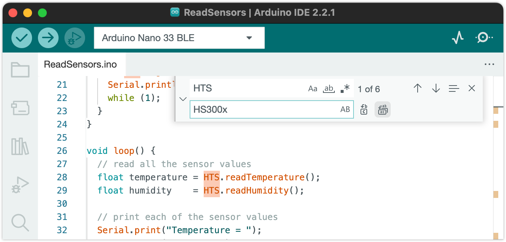

Some of the sensors in Nano 33 BLE Rev2 and Nano 33 BLE Sense Rev2 use different libraries than in the previous board revisions. Learn how to modify a sketch made for the original revision for use with a "Rev2" board.

In this article:

* [Use the new IMU sensor library for Rev2 boards](#imu)
* [Use the temperature and humidity sensor library for Nano 33 BLE Sense Rev2](#temperature-and-humidity)

---

## Use the new IMU sensor library for Nano 33 BLE Rev2 and Nano 33 BLE Sense Rev2

To use the IMU (inertial measurement unit) in Nano 33 BLE Rev2 and Nano 33 BLE Sense Rev2, you need to use the **Arduino_BMI270_BMM150** library instead of Arduino_LSM9DS1. If you're using the Arduino IDE, you can [install the libraries using the library manager](https://support.arduino.cc/hc/en-us/articles/5145457742236-Add-libraries-to-Arduino-IDE).

### Modify an existing sketch for Rev2

To make use of the library in your sketch, make the following modifications:

* **Modify the include statement:**

  1. Find the following include statement in your sketch:

     `#include <Arduino_LSM9DS1.h>`

  2. Edit the line to include the new library instead:

     `#include <Arduino_BMI270_BMM150.h>`

After making the modifications, save the changes and upload the modified sketch to your board.

### Learn more

* [Library documentation for Arduino_BMI270_BMM150](https://www.arduino.cc/reference/en/libraries/arduino_bmi270_bmm150/)
* [Nano 33 BLE Sense Rev2 Cheat Sheet – IMU](https://docs.arduino.cc/tutorials/nano-33-ble-sense-rev2/cheat-sheet#imu)

---

## Use the temperature and humidity sensor library for Nano 33 BLE Sense Rev2

To use the temperature and humidity sensor in Nano 33 BLE Sense Rev2, you need to use the **Arduino_HS300X** library instead of Arduino_HTS221. If you're using the Arduino IDE, you can [install the libraries using the library manager](https://support.arduino.cc/hc/en-us/articles/5145457742236-Add-libraries-to-Arduino-IDE).

### Modify an existing sketch for Rev2

Here's how you can modify an existing sketch (that uses the Arduino_HTS221 library) to use the new Arduino_HS300x library:

* Install the **Arduino_HS300X** library.

* **Modify the include statement:**

  1. Find the following include statement in your sketch:

     `#include <Arduino_HTS221.h>`

  2. Edit the line to include the new library instead:

     `#include <Arduino_HS300x.h>`

* **Replace any references to `HTS` with `HS300x`.** You can use one of these methods:

  * **Manually replace** any references to the `HTS` class with `HS300x`.

  * **Use the find & replace tool:** Open it by pressing <kbd>Ctrl</kbd> + <kbd>F</kbd> (Windows/Linux) / <kbd>Cmd</kbd> + <kbd>F</kbd> (macOS), then click the left-most down arrow to reveal the Replace field. Type "HTS" into the Find field, and "HS300x" into the Replace field. Then click the Replace All button.

     

After making the modifications, save the changes and upload the modified sketch to your board.

### Learn more

* [Library documentation for Arduino_HS300x](https://reference.arduino.cc/reference/en/libraries/arduino_hs300x/)
* [Learn more about the temperature and humidity sensor in Arduino Docs](https://docs.arduino.cc/tutorials/nano-33-ble-sense-rev2/cheat-sheet#temperature-and-humidity-sensor)

<!-- markdownlint-disable-file HC001 -->
