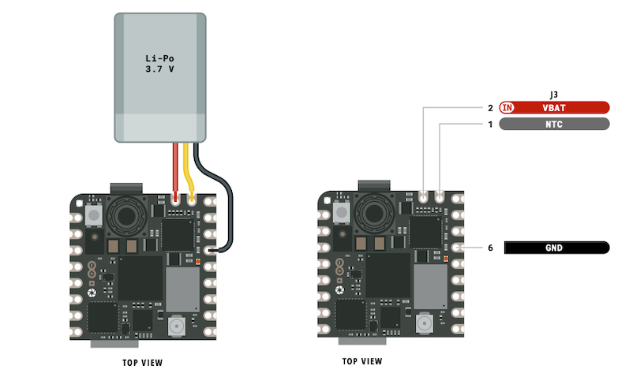

The Nicla Sense ME and the Nicla Vision can be powered with a single-cell 3.7 V Li-Po or Li-Ion battery.

You can connect the battery in two ways:

* [The header pins](#header-pins)
* [The battery connector](#battery-connector)

**Warning: Do not connect two batteries at the same time.**

---

## Using the header pins

A battery can be connected to these header pins:

* **VBAT**
* **GND**
* NTC (optional)

Below is an example for Nicla Vision. The pin locations are identical for Nicla Sense ME.

---

## Using the battery connector

The Nicla Sense ME and the Nicla Vision have a battery connector on the bottom of the board. The connector is a shrouded header from JST (model nr. BM03B-ACHSS-GAN-TF), and is compatible with their **ACHR-03V-S** connector housing. See the [JST ACH Connector datasheet](https://www.jst-mfg.com/product/pdf/eng/eACH.pdf) for details.

You can use this connector by purchasing the ACHR-03V-S connector from an electronic reseller and attaching crimped battery wires with the crimp lock on the connector.

On both Nicla Sense ME And Nicla Vision, the positive terminal of the battery will connect to the header pin **closest** to the USB connector. GND connects to the header pin **furthest** from the USB connector. If your battery has an NTC pin, connect it to the middle header pin (optional). See the example below for Nicla Vision, or check the [full pinouts](#pinouts).

## Pinouts

* [Full pinout for Nicla Sense ME](https://docs.arduino.cc/resources/pinouts/ABX00050-full-pinout.pdf)
* [Full pinout for Nicla Vision](https://docs.arduino.cc/resources/pinouts/ABX00051-full-pinout.pdf)
