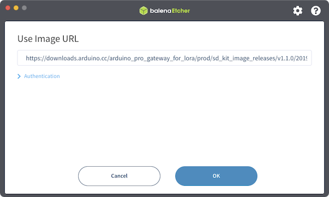
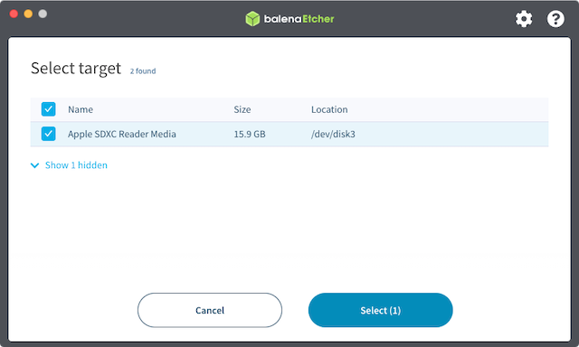

Flash the Arduino Pro Gateway image to a microSD card using balenaEtcher.

## What you'll need

* A computer running Windows, macOS, or Linux
* A microSD card reader (built-in or external)
* A microSD card (16 GB or larger)

## Steps

1. [Download and install balenaEtcher](https://www.balena.io/etcher/).

2. Insert the SD card.

3. Open balenaEtcher.

4. Select **Flash from URL** and use this URL: `https://downloads.arduino.cc/arduino_pro_gateway_for_lora/prod/sd_kit_image_releases/v1.1.0/20190206PROD_ArduinoProGateway_SD.zip`

   

5. In **Select target**, check the SD card as the target disk, then click Select.

   

6. Finally, select **Flash** and wait for the process to complete.

   

If your Pro Gateway was already activated in Manager for Linux, follow these steps to reactivate the gateway:

1. [Deactivate the gateway](https://support.arduino.cc/hc/en-us/articles/4407770459410) in Manager for Linux.
2. [Activate the gateway](https://support.arduino.cc/hc/en-us/articles/4407770369042) in Manager for Linux.
