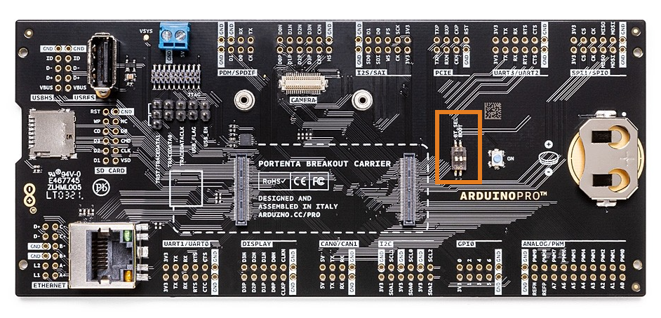

The Arduino Portenta Breakout board makes all high-density connectors individually accessible, making it quick and easy to connect external components and devices to your Portenta family board. The Breakout board comes with 2 DIP switches located on the top side of the board.

<table>
<tbody>
  <tr style="display: table-row;">
    <td rowspan="2"><b>BOOT_SEL</b></td>
    <td>ON</td>
    <td>Keeps the Portenta in Boot mode</td>
  </tr>
  <tr style="display: table-row;">
    <td>OFF</td>
    <td>Operation mode (default)</td>
  </tr>
  <tr style="display: table-row;">
    <td rowspan="2"><b>BOOT</b></td>
    <td>ON</td>
    <td>Enables the embedded bootloader. Firmware can be uploaded via the USB port on the breakout board (DFU). USB-A to USB-A (non-crossover) cable required. The Portenta H7 has to be powered through the USB-C connector or VIN.</td>
  </tr>
  <tr style="display: table-row;">
    <td>OFF</td>
    <td>Normal boot (default)</td>
  </tr>
</tbody>
</table>

Pay attention to the position of the DIP switches to ensure the right boot mode is selected before powering the board. If the RESET button does not behave as expected, or you are unable to enter _Bootloader Mode_, you should verify the DIP switch configuration.

**For the standard operation mode both DIP switches must be set to OFF**. To do so, simply position the white switches next to "1" and "2" respectively (opposite the "ON" label printed on the switch connector itself).
