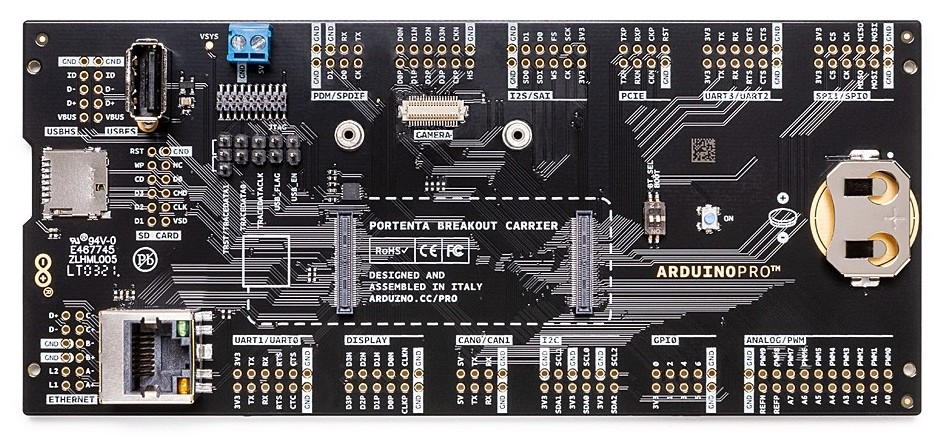

The Portenta family incorporates **two 80 pin high-density connectors** at the bottom of the board. This ensures scalability for a wide range of applications offering more features and increasing connectivity. In order to access the pins located in the high-density connectors easily during prototyping Arduino has developed the [Portenta Breakout](https://store.arduino.cc/products/portenta-breakout) board. 

The Arduino Portenta Breakout board makes all high-density connectors’ signals individually accessible, making it quick and easy to connect and test external hardware components and devices as normally needed during development in the lab.

To access the high-density pins with the breakout board is as simple as connecting the Portenta board on the designated connectors and the pins will be automatically exposed on the breakout board accordingly labeled for each designated group of pins and interfaces.

It is also possible to access the high-density pins manually through the connector type [DF40C-80DP-0.4V(51)](https://www.hirose.com/product/p/CL0684-4001-8-51). However, this option requires connector installation and individual connections to be made by the user. If you want to develop your own shield or breakout board, this is the mating connector part number: [DF40HC(3.5)-80DS-0.4V](https://www.hirose.com/en/product/p/CL0684-4162-7-51).
