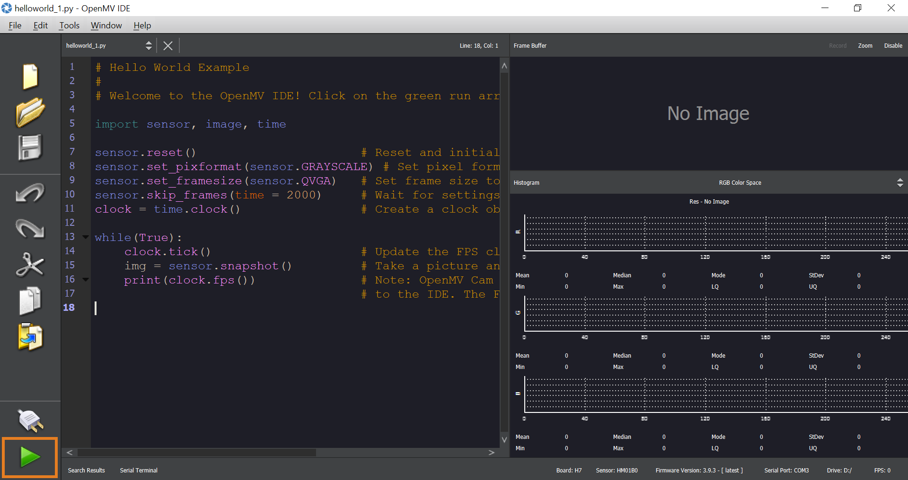

In order to program scripts for Portenta H7 with OpenMV it is necessary to flash the firmware that allows the board to load and run the programs from the OpenMV environment. This guide explains step-by-step how to set up the environment to get started with OpenMV.

---

1. Install/Update latest core version of **Arduino Mbed OS Portenta Boards**: In Arduino IDE go to *Tools > Board > Boards Manager* and search Portenta. Install/Update Arduino Mbed OS Portenta Boards.

2. **Update Portenta H7 bootloader**: This can be easily done from Arduino IDE and `STM32H747_updateBootloader` sketch from _File > Examples > STM32H747_System_. For step-by-step instructions, see [How to update the bootloader on Portenta H7](https://support.arduino.cc/hc/en-us/articles/4404067649554-How-to-update-the-bootloader-on-Portenta-H7).

3. Download and install the [**OpenMV IDE**](https://openmv.io/pages/download).

4. Connect the Portenta to your computer with a USB-C cable and set the board in bootloader mode by double pressing the reset button on the board. The built-in green LED will start fading in and out. Now open the OpenMV IDE.

5. Click on the "connect" symbol at the bottom of the left toolbar to attach the Portenta to the OpenMV IDE.

   

6. A pop-up will ask you how you would like to proceed "DFU bootloader(s) found. What would you like to do?". Select "Reset Firmware to Release Version". This will install the latest OpenMV firmware on the Portenta.

7. Next window will prompt whether it should erase the internal file system, click "No". Then Portenta's green LED will start flashing while the OpenMV firmware is being uploaded to the board. A terminal window will open which shows you the upload progress. Wait until the green LED stops flashing and fading. You will see a message saying "DFU firmware update complete!" when the process is done.

**Installing the OpenMV firmware will overwrite any existing sketches in the internal flash of Portenta. As a result, the M7 port won't be exposed in the Arduino IDE anymore. To re-flash the M7 with an Arduino firmware you need to put the board into bootloader mode. To do so, double press the reset button on the Portenta H7 board. The built-in green LED will start fading in and out. In bootloader mode you will see the Portenta M7 port again in the Arduino IDE.**

The Portenta flashes its blue LED when it's ready to be connected. After confirming the completion dialog the Portenta should already be connected to the OpenMV IDE. Otherwise, click the "connect" button again.

When the Portenta is successfully connected to the OpenMV IDE a green play button appears in the lower left. Pressing the play button will automatically run the script that is inserted in the coding area.
