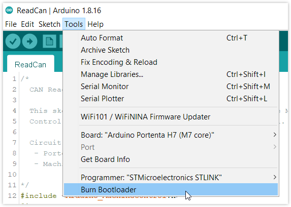
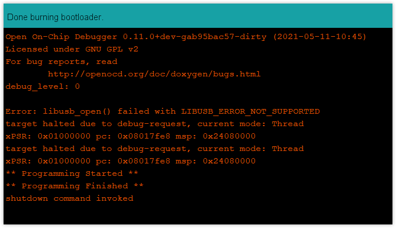

The bootloader is a small program that runs when you turn the Arduino on or press the reset button. Its main function is to receive and write a new sketch to memory. Unsafe code, improper power supply, and short circuits may result in the bootloader being corrupted. Restore the bootloader by following this guide.

---

## What you'll need

* Portenta H7
* A compatible carrier:
  * [Portenta Breakout](https://store.arduino.cc/products/arduino-portenta-breakout)
  * [Portenta Max Carrier](https://store.arduino.cc/products/portenta-max-carrier)
* [STLINK programmer for STM32](https://www.st.com/en/development-tools/stlink-v3set.html)
* JTAG connector cable (STLINK programmer to the carrier)
* [Arduino IDE](https://www.arduino.cc/en/software)

## Step-by-step instructions

01. Find the [DIP switches](https://support.arduino.cc/hc/en-us/articles/4402095376402-DIP-switches-on-Portenta-Breakout-board) on the carrier and set both **BOOT_SEL** and **BOOT** to **ON**.

02. Attach Portenta H7 to the carrier.

03. Connect Portenta H7 to your PC with a USB-C cable.

04. Connect the STLINK programmer to the PC with a USB cable.

05. Connect the JTAG cable from the STLINK programmer to the JTAG on the carrier.

06. Open Arduino IDE.

07. In the top menu bar, open _Tools > Board_ and select _Arduino Mbed OS Portenta Boards > Portenta H7 (M7 Core)_.

08. Select the programmer in _Tools > Programmer_.

    

09. Select _Tools > Burn Bootloader_ to burn the bootloader.

    

10. Wait for the process to complete.

    
