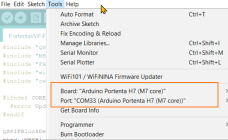
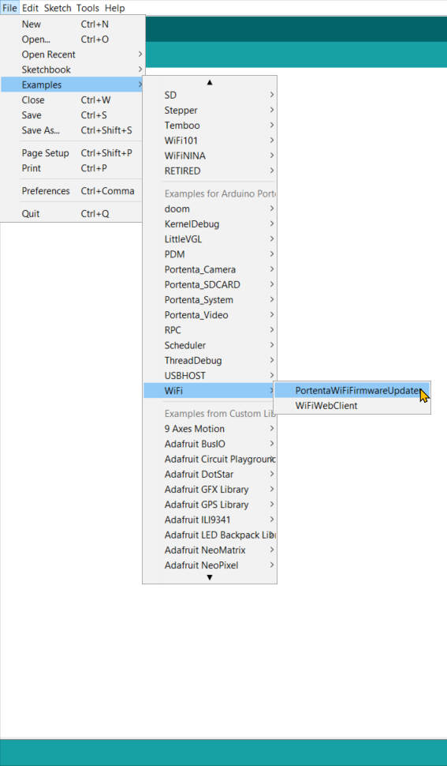
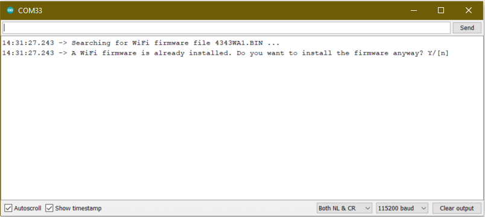
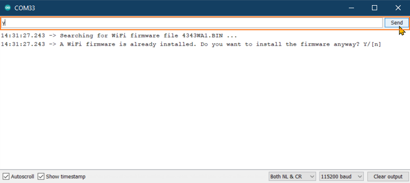
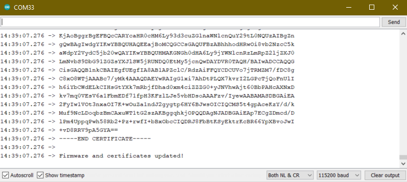

In this article, we will go through a step-by-step process on how to get the latest Wi-Fi firmware on your Portenta H7 board. Before updating the WiFi firmware, make sure the bootloader is up-to-date. You can update the bootloader by following the Portenta documentation page [here](https://docs.arduino.cc/tutorials/portenta-h7/updating-the-bootloader).

## Requirements

1. Arduino Portenta H7
2. USB-C Cable
3. Latest Arduino IDE (1.8 or 2.0)
4. Latest Bootloader on the board

## Steps

1. Make sure that the board is properly connected to your computer using the USB C cable.

2. Select the board and port number of the board under the tools options of the IDE.

   

3. Open the Arduino IDE, click on `File > Examples`, and under the category _Examples for Arduino Portenta_, click `WiFi > PortentaWiFiFirmwareupdater`.

   

4. Upload the sketch, wait for the upload to complete and then open the Serial Monitor.

   

5. You can observe that there is already Wi-Fi Firmware on the board and you are going to overwrite that firmware. Type `Y` in the serial monitor and press send.

   

6. Wait a few seconds till you get the message **Firmware and Certificates updated** on the serial monitor.

   

   Done! You now have the latest Wi-Fi Firmware version on your Portenta.
