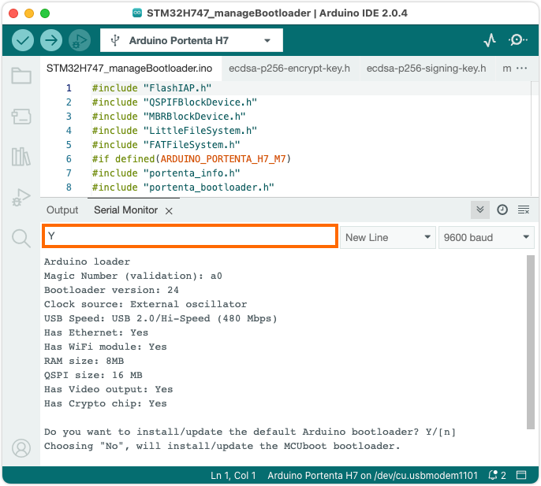

A bootloader is a small application that starts when an Arduino board gets powered. Official Arduino boards come pre-flashed with a bootloader, but to guarantee the best performance and stability it needs to be updated with the latest firmware releases.

## Supported boards

* Portenta H7
* Portenta H7 Connected
* Portenta H7 Connected Lite

## Before you begin

[Install the latest version](https://support.arduino.cc/hc/en-us/articles/360016119519-Add-boards-to-Arduino-IDE) of **"Arduino Mbed OS Portenta Boards"** in Arduino IDE.

## Instructions

1. Connect your Portenta H7 board to your computer and select it in Arduino IDE.

1. Go to **File > Examples > STM32H747_System** and open the **STM32H747_manageBootloader** sketch.

   <!--  -->

1.  **Upload** the sketch.

1. Open the Serial Monitor with **Tools > Serial Monitor**.

1. When the sketch starts running on the board it will output some device information to the Serial Monitor, check the **Bootloader version** to see the version currently installed. The device information is followed by this prompt:

   ```
   Do you want to install/update the default Arduino bootloader? Y/[n]
   Choosing "No", will install/update the MCUboot bootloader.
   ```

1. To continue installing the Arduino bootloader, type `Y` in the text field and press `Enter` to submit.

   

1. If you already have the latest bootloader, you will get this message:

   ```
   The latest version of the bootloader is already installed (vX).
   Do you want to update the bootloader anyway? Y/[n]
   ```

   If so, type `Y` in the text field and press `Enter` to submit.

1. The bootloader flashing process will now start. You will see the message `Bootloader update complete. It's now safe to reboot or disconnect your board.` when the process is complete.

## Troubleshooting

* If you're having trouble uploading the sketch, or if a LED on the board is flashing red, double-press the reset button to set the board to **bootloader mode** before uploading.
* If the Serial Monitor is empty after uploading the sketch, press the reset button to restart the sketch.
* You may need to scroll down to show new lines in the Serial Monitor.
* If you get an `Compilation error: QSPIFBlockDevice.h: No such file or directory` error, check your board selection and note that this sketch is not compatible with Portenta X8[^1].

[^1]: https://github.com/arduino/ArduinoCore-mbed/issues/529
