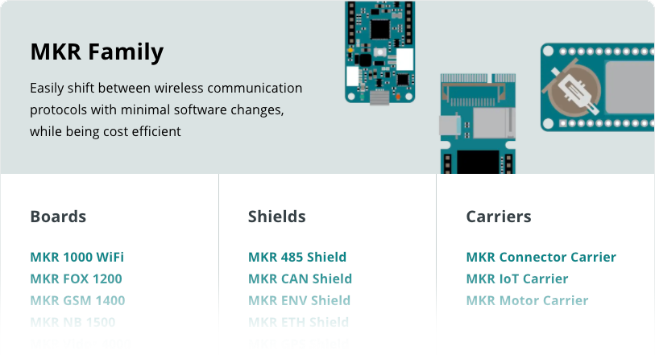
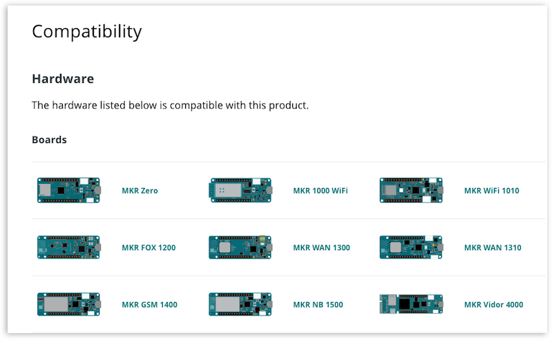
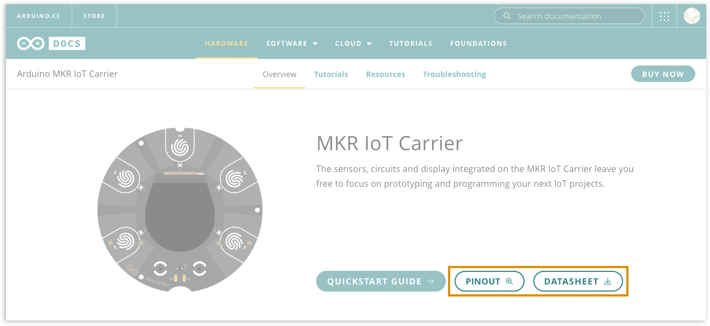
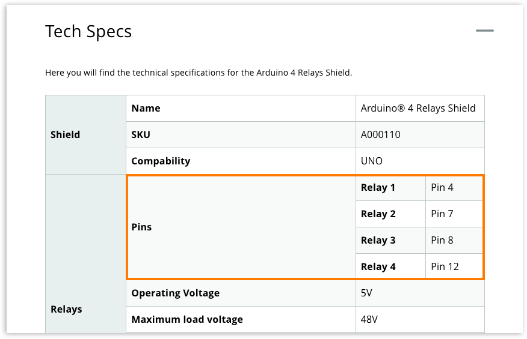

Shields and carriers can extend the functionality of your Arduino board. Learn how to find boards, shields, and carriers that are compatible.

---

## Using only two devices

Make sure you are using devices from within the same _family_. You can check this in [Arduino Docs](https://docs.arduino.cc/).

These configurations use only two devices:

* One board, with one shield connected.
* One board, with one carrier connected.

For these, you can open the page for the **shield or carrier** (not the board) in [Arduino Docs](https://docs.arduino.cc/), and find compatible boards under the _Compatibility_ tab.

## Using more than two devices

For more complex configurations (i.e. stacking more than one shield and/or carrier), compatibility is less straightforward. A set of devices are compatible if the following conditions are met:

* They have the same footprint (part of the same product family)
* Except for SPI and I2C, they do not communicate on the same pins, or can be configured not to.

The following resources can be used to determine which pins are used, and check for conflicts.

### Pinouts, datasheets, and tech specs

In [Arduino Docs](https://docs.arduino.cc/) you can find _pinout diagrams_ and _datasheets_ for many devices.

1. Go to [Arduino Docs](https://docs.arduino.cc/).
2. Open the documentation page for the device.
3. Check if a Pinout or Datasheet button is available.

> [!NOTE]
> Pinouts and datasheets may not be available for some devices.

On the device Arduino Docs page, pins may also be specified in the _Tech specs_ section.

### Store page

Additional information may be available on the product page in the [Arduino Store](https://store.arduino.cc/).

## Resolving device conflicts

* Remap pins using a perfboard, jumper wires, or a specialized product such as the [Proto Shield](https://store.arduino.cc/products/proto-shield-rev3-uno-size). For digital pins, don't forget to update `digitalRead()` and `digitalWrite()` function calls in your sketch.
* Some shields, such as the [Motor Shield Rev3](https://store.arduino.cc/products/arduino-motor-shield-rev3), have optional functionality that can be disabled by cutting the respective jumpers on the shield.

## Still need help?

* The [project guidance category](https://forum.arduino.cc/c/using-arduino/19) or in one of the [hardware categories](https://forum.arduino.cc/c/12) in the Arduino Forum.
* [Contact us](https://www.arduino.cc/en/contact-us/).
