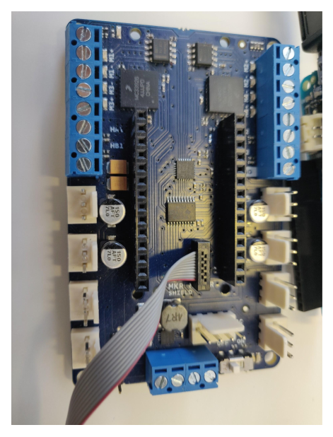
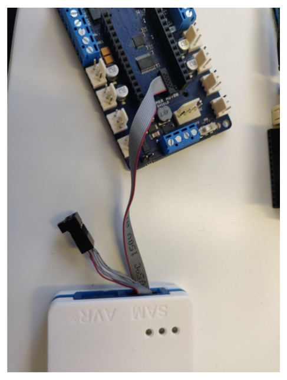
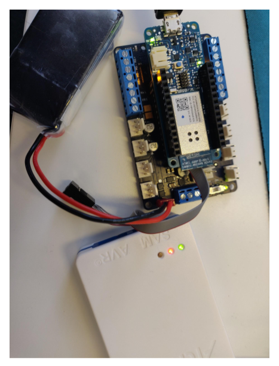

## Steps

1. Connect the Target cable to the Mkr Motor Carrier as shown in the picture below:

   > **Note:** Make sure you connect the cable in the same direction as shown in the picture.

   

2. Connect the Target cable other end of 10 pins to the ATMEL ICE **SAM port** as shown in the picture below:

   

3. Now, mount the MKR 1000 on top of the Mkr motor carrier.

4. Power the MKR1000 board with a data USB cable and Mkr Motor carrier with the Battery.

   

5. Download and extract this zip folder: [Zip](https://drive.google.com/open?id=1LevX_yA_IrSzuwEd1CHOv_D3iVnhYe8X)

6. Open Command prompt in your computer.

7. Copy and paste the below commands:

   > Note: Make sure that the file path is the same as the location of the downloaded folder.

   ```
   C:\Users\Default(username)\Desktop\openocd\0.9.0-arduino6-static\bin\openocd -d2 -s
   C:\Users\Default(username)\Desktop\openocd\0.9.0-arduino6-static\share\openocd\scripts -f "C:\Users\Default(username)\Desktop\SAMD11D14AS.cfg" -c "telnet_port disabled; init; at91samd chip-erase; program C:/Users/Default(username)/Desktop/bootloader_fw_0.06.bin verify reset ;shutdown"
   ```
