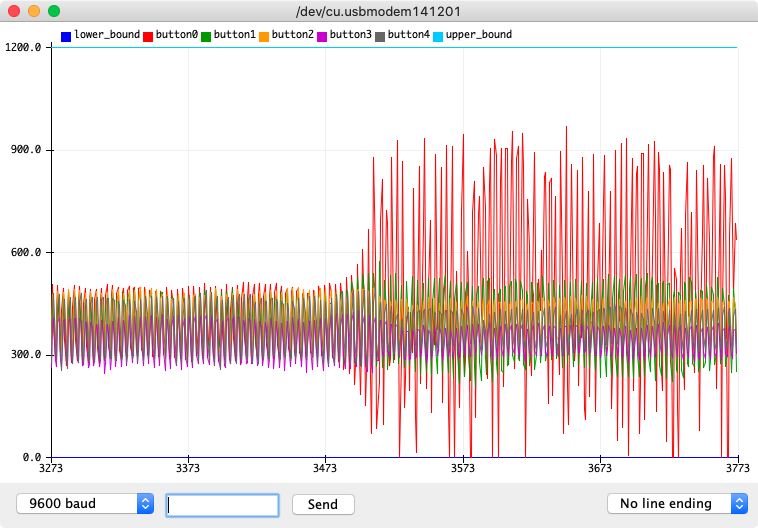

The MKR IoT Carrier has five buttons with capacitive sensors labeled 00, 01, 02, 03, and 04 on the carrier board. By measuring capacitance they can respond when pressed, both with and without the plastic casing.

When the capacitive buttons are unresponsive, this basic test can be used to verify that the button sensors are producing a signal. If this test succeeds, you can try [calibrating the buttons instead](https://support.arduino.cc/hc/en-us/articles/360021221980).

---

1. Create a new sketch in the Arduino IDE.

2. Copy this code and paste it into the editor.

   ```
   #include <Arduino_MKRIoTCarrier.h>
   MKRIoTCarrier carrier;

   void setup() {
     // put your setup code here, to run once:
     Serial.begin(9600);
     carrier.begin();
   }

   void loop() {
     // put your main code here, to run repeatedly:
     Serial.print("lower_bound:0, ");
     //Serial.print(value);
     for (int i = 0; i < 5; i++) {
       Serial.print("button");
       Serial.print(i);
       Serial.print(":");
       Serial.print(analogRead(i));
       Serial.print(", ");
     }
     Serial.println("upper_bound:1200");
     delay(10);
   }
   ```

3. Upload the sketch to the board.

4. Open the Serial Plotter (*Tools > Serial Plotter*). Monitor the response of each button when pressed.

   

   *Testing button0 in the Serial Plotter. Note the distinct increase in amplitude at x=900 when the button is touched. Button1, the adjacent button, also sees a slight increase in amplitude.*
