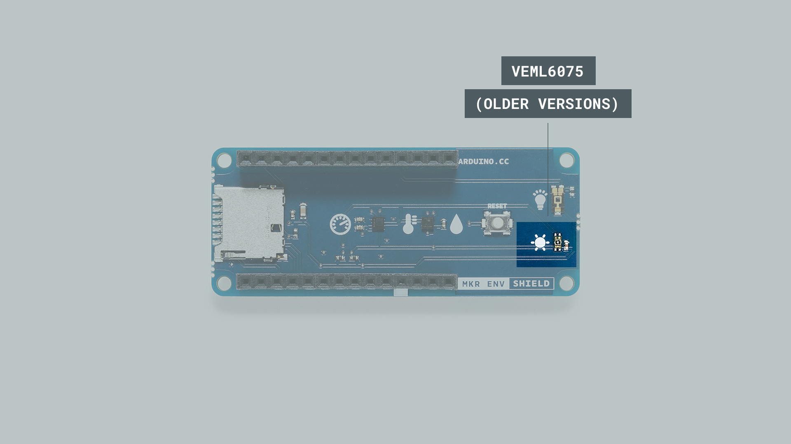

Over time, the MKR ENV shield has gone through some changes, the oldest version has an integrated `VEML6075`, an UVA and UVB light sensor. This sensor is not present in most recent versions, although there is a small batch where the sunlight symbol was kept in the silk layer of the board (the white symbols and letters) but there is no component, so the board will not be able to sense sunlight.

