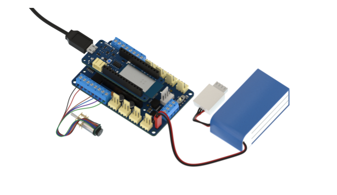

If the red led besides the power led is 'ON' while uploading the Motor_test example (_File > Examples > Motor_test_), it means that the firmware of the MKRMotor carrier has to be updated and in order to update the firmware on the MKRMotor carrier, we recommend you to follow the instructions below:

1. Mount the Mkr1000 on the MKRmotor carrier.
2. Connect the Dc encoder motor and the battery to the carrier.
3. Power the board using the USB cable. Below attached is the picture for references:

   

4. Now, slid the battery power switch to on status.
5. Upload the flasher example (_File > Examples > MKRMotor Carrier > Flasher_).
6. Open the serial monitor and check if the firmware is updated successfully.
7. Retry to upload the Motor_test example sketch (_File > Examples > Motor_test_) and check if the DC encoder motors connected to the carrier are working as expected.
