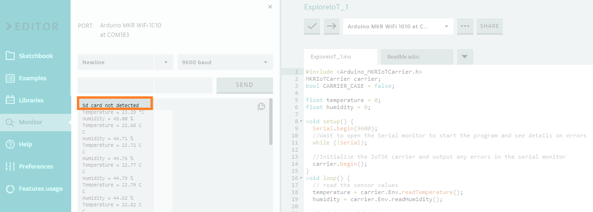

Even if there is no specific line in the main code stating to write this message in the serial port, this message will appear whenever there is no card or an issue with the attached cart in the carrier.

This message comes from the MKR IoT library included in the code when using the carrier as `#include <Arduino_MKRIoTCarrier.h>`, and it's displayed when initializing and testing the Carrier's different sensors and actuators.

> [!NOTE]
> If you want to check more in depth what's in the library, all the files are available in our github.
> Check here the [Arduino_MKRIoTCarrier.cpp file](https://github.com/arduino-libraries/Arduino_MKRIoTCarrier/blob/master/src/Arduino_MKRIoTCarrier.cpp#L84).

If you are seeing this message, even if the SD card is attached to the carrier, please make sure the metal connectors are clean so the carrier can correctly interact with the SD. Please also make sure the card is correctly attached and pushed completely into the card holder.
