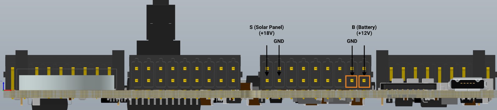
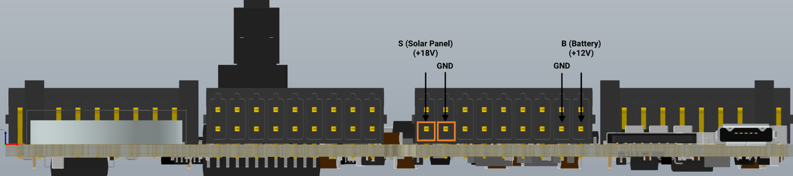

Learn about the power supply requirements for the Arduino Edge Control.

> **Note:** Operating the board without a CR2032 battery can cause unexpected behavior with the RESET button and damage the board.

## Upload and run sketches

Connecting a micro USB cable provides sufficient power to upload and run a sketch on the nRF52840 microcontroller. However, this configuration does not provide enough power to operate other modules of the board, so the main Edge Control features will not be available.

See the [Getting Started guide](https://docs.arduino.cc/tutorials/edge-control/getting-started-edge-control) for more help with programming the Edge Control.

## Connect a power supply

An external power supply is required to enable most features of the board including the I/O expander, multiplexers, DCDC converters and drivers for the valve control.

### Using a 12 V power supply

Connect the 12 V output to the **B (Battery)** and **GND (Ground)** pins of the edge control. Find these pins by looking for the set of pins that are labeled as "RELAY" on the back of the board. Make sure the 18 pin connectors (phoenix contact 1844646) are connected to access these pins easily. Then, simply push the orange tab down and insert the wire to complete the connection.

You can use a 12 V power supply/adaptor or a 12 V lead-acid battery.

### Using a solar panel

An 18 V solar panel can be connected to power the board and/or charge the lead-acid battery. Use the **S (Solar)** and **GND (Ground)** pins to connect the solar panel to the board.

