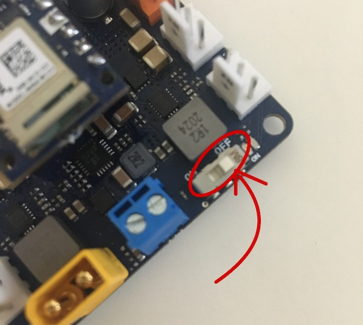
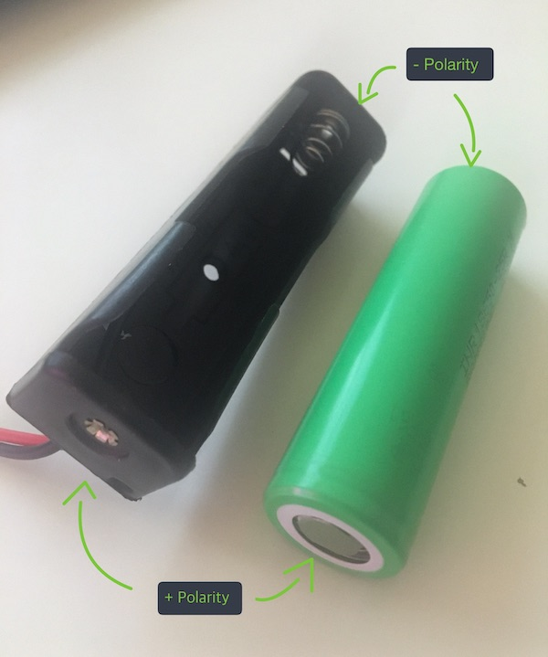
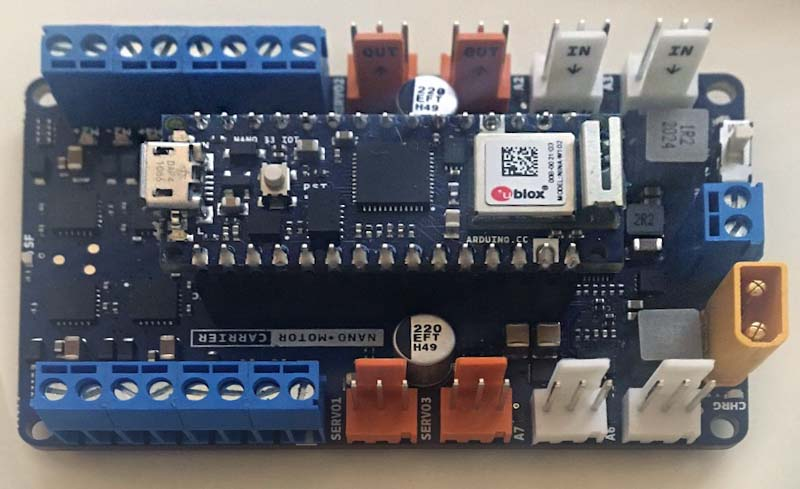
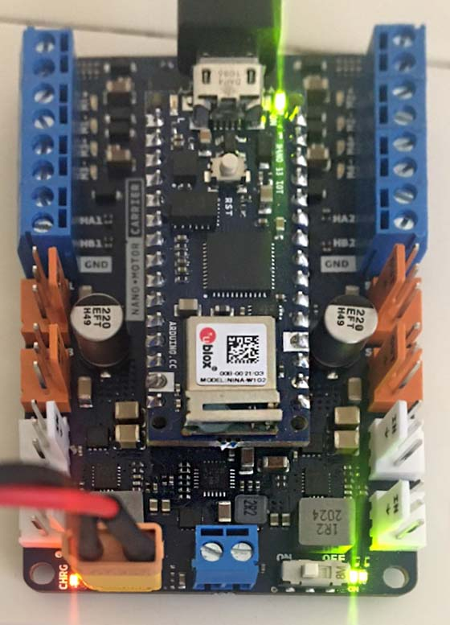

The Nano Motor Carrier requires external power to operate properly. Learn how to power the carrier by connecting a Li-Ion battery to the XT-30 power connector.

---

## What you'll need

* Nano Motor Carrier
* Arduino Nano board (eg. Nano 33 IoT)
* A 18650 3.7 V Li-ion battery
* 18650 battery holder

## Instructions

1. Ensure that the battery switch on the carrier is set to `OFF` and the USB cable is unplugged.

   

2. Place the battery in the holder. Make sure that the polarity (+/-) of the battery is facing the right way.

   

3. Place the Nano on top of the carrier so that the pin labels are aligned. Press down on the board to attach it.

   

4. Connect the battery header from the holder to the socket header of the carrier. Ensure that the black wire is aligned with `GND` and the red one is aligned with `VIN`.

5. Set the battery switch on the carrier to `ON`.

6. Power the board using the USB cable.

The image below demonstrates the completed assembly, along with all indicator lights that should be on.

