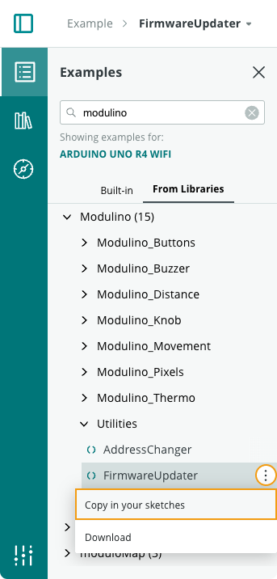

Learn how to update the firmware of a [Modulino node](https://store-usa.arduino.cc/products/plug-and-make-kit?srsltid=AfmBOopomr-DZVLRzl_VhXSSemiNa75qfABCHjqhvLQs7vz9_2PLgQN9#:~:text=technology%20%E2%80%93%20and%20yours.-,What%20are%20Modulino%C2%AE%3F,-Modulino%C2%AE%20are%20sensors).

Updating the firmware may be necessary to resolve issues with Modulino nodes.

In this article:

- [Update Modulino firmware in Arduino IDE 2](#update-modulino-firmware-in-arduino-ide-2)
- [Update Modulino firmware in Arduino Cloud Editor](#update-modulino-firmware-in-arduino-cloud-editor)

---

## Update Modulino firmware in Arduino IDE 2

1. Connect the Modulino to your Arduino UNO R4 WiFi.

2. Connect the board to your computer and open Arduino IDE 2.

3. [Go to the Library Manager and install the "Modulino" library](https://support.arduino.cc/hc/en-us/articles/5145457742236-Add-libraries-to-Arduino-IDE).

4. In the top menu bar, open **File > Examples > Modulino > Utililities > FirmwareUpdater**.

5. Click  **Upload** to upload the sketch to your Arduino UNO R4 WiFi.

6. The firmware update is complete when the sketch is successfully uploaded to the board.

7. You can now test the Modulino by uploading an example from **File > Examples > Modulino**.

---

## Update Modulino firmware in Arduino Cloud Editor

1. Connect the Modulino to your Arduino UNO R4 WiFi.

2. Connect the board to your computer and [open the Cloud Editor](https://support.arduino.cc/hc/en-us/articles/13809101080732-Open-the-Cloud-Editor).

3. Go to the **Examples** tab on the left-side panel, and select **From Libraries**.

4. Search for "Modulino" and open **Modulino > Utililities > FirmwareUpdater**.

5. Copy the "FirmwareUpdater" example to a new sketch.

    

6. Click  **Upload** to upload the sketch to your Arduino UNO R4 WiFi.

7. The firmware update is complete when the sketch is successfully uploaded to the board.

8. You can now test the Modulino by [importing a Modulino Template](https://support.arduino.cc/hc/en-us/articles/14826942993308-Import-an-Arduino-Cloud-Template).
