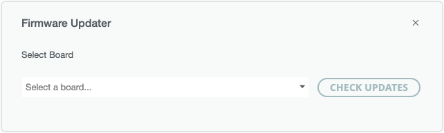
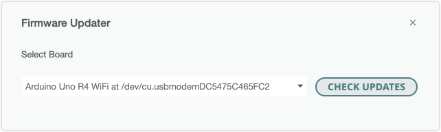
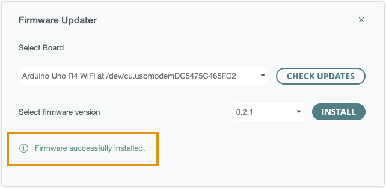
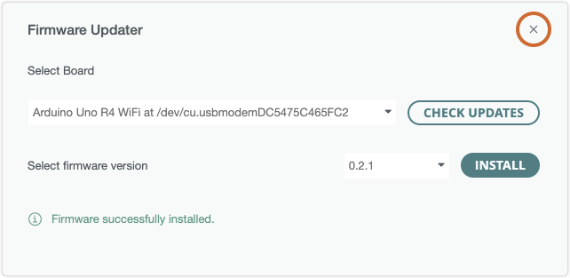

Learn how to update the firmware of the ESP32-S3 connectivity module on the UNO R4 WiFi. This firmware is required to use your board with Arduino Cloud and for the board to be correctly detected on a USB port by Arduino development tools.

In this article:

* [Use the Firmware Updater in Arduino IDE](#ide)
* [Use Arduino Cloud to update the firmware](#cloud)
* [Use the Arduino Firmware Uploader CLI utility](#cli)
* [If you can't update the firmware](#if-you-cant-update-the-firmware)

---

## Use the Firmware Updater in Arduino IDE {#ide}

Updating the connectivity firmware is easy when using the Firmware Updater in Arduino IDE 2.2.1 or later.

Follow these steps:

1. Connect the board to your computer and open Arduino IDE 2.

2. If the Serial Monitor is open, close it.

3. In the top menu bar, open **Tools > Firmware Updater**.

   

4. Select UNO R4 WiFi in the drop-down menu and click the **Check Updates** button.

   

   > If your UNO R4 WiFi doesn't appear in the list, make sure it's securely connected with a working data USB cable, and try pressing the RST button on the board. If it still doesn't appear, it may be missing the USB bridge firmware. Follow [these instructions](https://support.arduino.cc/hc/en-us/articles/16379769332892) to resolve the issue.

5. Select the latest firmware version on the drop-down menu and click **Install**.

   > [!NOTE]
   > Installation will overwrite any existing sketch on your board.

    

6. Wait until the text "Firmware successfully installed" is displayed.

   

7. Disconnect and reconnect the UNO R4 WiFi board from your computer.

   > **Warning:** After flashing the firmware on the UNO R4 WiFi, the board will remain in **ESP Download** mode until you disconnect and reconnect it from your computer. If you upload a sketch while the board is in ESP Mode, it will erase the special firmware that lets the ESP32 chip function as an USB bridge.

8. Close the Firmware Updater by clicking the "x" in the top-right corner of the Firmware Updater window.

   

---

## Use Arduino Cloud to update the firmware {#cloud}

When you add a new device to Arduino Cloud, the connectivity module firmware is automatically updated.

[Update connectivity module firmware with Arduino Cloud](https://support.arduino.cc/hc/en-us/articles/10501616961564-Update-connectivity-module-firmware-with-IoT-Cloud){.link-chevron-right}

---

## Use the Arduino Firmware Uploader CLI utility {#cli}

Arduino IDE and Arduino Cloud both employ the **Arduino Firmware Uploader** tool. If you prefer, you can use it directly as a command-line application. You can find the [user documenation here](https://arduino.github.io/arduino-fwuploader/2.4/).

---

 <!-- This section previously contained the full procedure, keep this for old URLs -->

## If you can't update the firmware {#if-you-cant-update-the-firmware}

> [!NOTE]
> This section was previously titled **Run espflash directly**.

The above methods will not work if the board cannot be identified as a UNO R4 WiFi. This can happen if the custom firmware for the ESP32-S3 connectivity module is missing completely, or is not functioning correctly. However, the board can still be restored using the **espflash** utility:

[Restore the USB connectivity firmware on UNO R4 WiFi with espflash](https://support.arduino.cc/hc/en-us/articles/16379769332892){.link-chevron-right}
