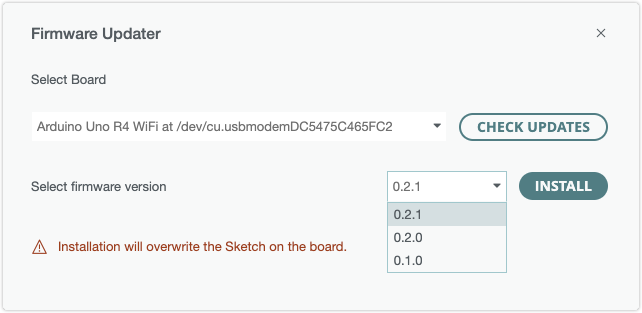

Learn how to update the firmware of the ESP32-S3 connectivity module on the UNO R4 WiFi.

Updating the firmware is required to use UNO R4 WiFi with Arduino Cloud, and can resolve issues with UNO R4 WiFi not being detected by Arduino IDE and other development tools.

In this article:

* [Use the Firmware Updater in Arduino IDE](#ide)
* [Use Arduino Cloud to update the firmware](#iot)
* [Use the updater script](#unor4wifi-updater)
* [Run espflash directly](#espflash)

---

<a id="ide"></a>

## Use the Firmware Updater in Arduino IDE

Updating the connectivity firmware is easy when using the Firmware Updater in Arduino IDE 2.2.1 or later.

Follow these steps:

1. Connect the board to your computer and open Arduino IDE 2.

2. If the Serial Monitor is open, close it.

3. In the top menu bar, open **Tools > Firmware Updater**.

    

4. Select UNO R4 WiFi in the drop-down menu and click the **Check Updates** button.

    

    > If your UNO R4 WiFi doesn't appear in the list, make sure it's securely connected with a working data USB cable, and try pressing the RST button on the board. If it still doesn't appear, it may be missing the USB bridge firmware. Follow the steps in [Run espflash directly](#run-espflash-directly) to resolve the issue.

5. Select the latest firmware version on the drop-down menu and click **Install**

   > **Note:** Installation will overwrite any existing sketch on your board.

    

6. Wait until the text "Firmware successfully installed" is displayed.

    

7. Disconnect and reconnect the UNO R4 WiFi board from your computer.

   > **Warning:** After flashing the firmware on the UNO R4 WiFi, the board will remain in **ESP Download** mode until you disconnect and reconnect it from your computer. If you upload a sketch while the board is in ESP Mode, it will erase the special firmware that lets the ESP32 chip function as an USB bridge.

8. Close the Firmware Updater by clicking the "x" in the top-right corner of the Firmware Updater window.

    

---

<a id="iot"></a>

## Use Arduino Cloud to update the firmware

When you add a new device to Arduino Cloud, the connectivity module firmware is automatically updated.

<a class="link-chevron-right" href="https://support.arduino.cc/hc/en-us/articles/10501616961564-Update-connectivity-module-firmware-with-IoT-Cloud">Learn more</a>

---

<a id="unor4wifi-updater"></a>

## Use the updater script <!-- TODO -->

The code repository for the firmware provides an [updater script](https://github.com/arduino/uno-r4-wifi-usb-bridge/tree/main/unor4wifi-updater) that can be used as an alternative to the above options.

<a id="windows"></a>

### Windows

1. Unplug any non-essential USB devices from your computer.
1. Connect the UNO R4 WiFi board to your computer with the USB cable.
1. Download <a class="link-download" href="https://github.com/arduino/uno-r4-wifi-usb-bridge/releases/latest/download/unor4wifi-update-windows.zip">unor4wifi-update-windows.zip</a>
1. [Unzip](https://support.microsoft.com/windows/f6dde0a7-0fec-8294-e1d3-703ed85e7ebc) the downloaded file.
1. Double-click on the `update.bat` file that is in the unzipped folder.
   > **Note:** Depending on your Windows security settings, a **Windows protected your PC** dialog may open with this message:
   >
   > _Microsoft Defender SmartScreen prevented an unrecognized app from starting. Running this app might put your PC at risk._
   >
   > Click the **More info** link in the dialog and then click the **Run anyway** button to continue.
1. A terminal window will open. The terminal window might now show a list of the serial ports present on your computer.

   For example:

   ```text
   Start flashing firmware
   [2023-07-11T06:39:09Z INFO ] Detected 2 serial ports
   [2023-07-11T06:39:09Z INFO ] Ports which match a known common dev board are highlighted
   [2023-07-11T06:39:09Z INFO ] Please select a port
   ❯ COM1
     COM43 - USB Serial Device (COM43)
   ```

   If so, use the <kbd>**↓**</kbd> key on your keyboard to select the port of the **UNO R4 WiFi** board from the list, and then press the <kbd>**Enter**</kbd> key.
1. The terminal window will now show the following prompt:

   ```text
   ? Remember this serial port for future use? (y/n) ›
   ```

   Press the <kbd>**N**</kbd> key on your keyboard.
1. The flashing process should now start. Wait for it to finish, as indicated by output that looks something like this:

   ```text
   Chip type:         esp32s3 (revision v0.1)
   Crystal frequency: 40MHz
   Flash size:        8MB
   Features:          WiFi, BLE
   MAC address:       dc:54:75:c4:c6:54
   [00:00:15] [========================================]     689/689     0x0
   Press any key to continue . . .
   ```

1. Press any key on your keyboard to close the terminal window.
1. Disconnect the USB cable of the **UNO R4 WiFi** board from your computer.
1. Connect the **UNO R4 WiFi** board to your computer with the USB cable again.

**Troubleshooting for Windows:**

If you get a `VCRUNTIME140.dII was not found` error, download and install the <a class="link-top-right" href="https://learn.microsoft.com/en-us/cpp/windows/latest-supported-vc-redist?view=msvc-170#visual-studio-2015-2017-2019-and-2022">Microsoft Visual C++ Redistributable package</a> from Microsoft.

### macOS

1. Unplug any non-essential USB devices from your computer.
1. Connect the UNO R4 WiFi board to your computer with the USB cable.
1. Download <a class="link-download" href="https://github.com/arduino/uno-r4-wifi-usb-bridge/releases/latest/download/unor4wifi-update-macos.zip">unor4wifi-update-macos.zip</a>
1. [Unzip](https://support.apple.com/en-ca/guide/mac-help/mchlp2528/mac) the downloaded file.
1. Control-click on the unzipped `unor4wifi-update-macos` folder and select "**New Terminal at Folder**" from the context menu. A terminal window will open.
1. Type the following command in the **Terminal** window:

   ```text
   chmod a+x update.command && sudo xattr -d com.apple.quarantine bin/espflash && sudo xattr -d com.apple.quarantine bin/unor4wifi-reboot-macos
   ```

1. Press the <kbd>**Enter**</kbd> key.
1. Type your macOS user password in the "Password" prompt and press the <kbd>**Enter**</kbd> key again.
1. Type the following command in the **Terminal** window:

   ```text
   ./update.command
   ```

1. Press the <kbd>**Enter**</kbd> key.
1. The terminal window might now show a list of the serial ports present on your computer.

   For example:

   ```text
   Start flashing firmware
   [2023-07-11T08:55:51Z INFO ] Detected 6 serial ports
   [2023-07-11T08:55:51Z INFO ] Ports which match a known common dev board are highlighted
   [2023-07-11T08:55:51Z INFO ] Please select a port
   ❯ /dev/cu.wlan-debug
     /dev/tty.wlan-debug
     /dev/cu.Bluetooth-Incoming-Port
     /dev/tty.Bluetooth-Incoming-Port
     /dev/cu.usbmodem2214101 - USB JTAG_serial debug unit
     /dev/tty.usbmodem2214101 - USB JTAG_serial debug unit
   ```

   If so, use the <kbd>**↓**</kbd> key on your keyboard to select the `dev/cu.usbmodem*` port for **USB JTAG_serial debug unit** and then press the <kbd>**Enter**</kbd> key.

1. The terminal window will now show the following prompt:

   ```text
   ? Remember this serial port for future use? (y/n) ›
   ```

   Press the <kbd>**N**</kbd> key on your keyboard.
1. The flashing process should now start. Wait for it to finish, as indicated by output that looks something like this:

   ```text
   [2023-07-11T08:59:44Z INFO ] Serial port: '/dev/cu.usbmodem2214101'
   [2023-07-11T08:59:44Z INFO ] Connecting...
   [2023-07-11T08:59:45Z INFO ] Using flash stub
   Chip type:         esp32s3 (revision v0.1)
   Crystal frequency: 40MHz
   Flash size:        8MB
   Features:          WiFi, BLE
   MAC address:       dc:54:75:c4:c6:54
   [00:00:14] [========================================]     689/689     0x0
   ```

1. Close the **Terminal** window.
1. Disconnect the USB cable of the **UNO R4 WiFi** board from your computer.
1. Connect the **UNO R4 WiFi** board to your computer with the USB cable again.

**Troubleshooting for macOS:**

* If you get a `Cannot put the board in ESP mode. (via 'unor4wifi-reboot')` error: disconnect and reconnect the board, then run the command again.
* If you get an `xattr: bin/espflash: No such xattr: com.apple.quarantine` or `xattr: bin/espflash: No such xattr: com.apple.quarantine` error, it means that the command has already been run, or is otherwise not needed. Proceed with the next step.

<a id="linux"></a>

## Linux

1. Unplug any non-essential USB devices from your computer.
1. Connect the UNO R4 WiFi board to your computer with the USB cable.
1. Download <a class="link-download" href="https://github.com/arduino/uno-r4-wifi-usb-bridge/releases/latest/download/unor4wifi-update-linux.zip">unor4wifi-update-linux.zip</a>
1. Extract the downloaded ZIP file.
1. Open [a command line terminal](https://ubuntu.com/tutorials/command-line-for-beginners) in the extracted folder.
1. Type the following command:

   ```text
   ./update.sh
   ```

1. Press the <kbd>**Enter**</kbd> key.
1. The terminal window might now show a list of the serial ports present on your computer.

   For example:

   ```text
   Start flashing firmware
   [2023-07-12T15:02:36Z INFO ] Detected 3 serial ports
   [2023-07-12T15:02:36Z INFO ] Ports which match a known common dev board are highlighted
   [2023-07-12T15:02:36Z INFO ] Please select a port
   ❯ /dev/ttyACM0 - 7 Series/C210 Series Chipset Family USB xHCI Host Controller
     /dev/ttyS4
     /dev/ttyS0
   ```

   If so, use the <kbd>**↓**</kbd> key on your keyboard to select the port of the **UNO R4 WiFi** board from the list, and then press the <kbd>**Enter**</kbd> key.
1. The terminal window will now show the following prompt:

   ```text
   ? Remember this serial port for future use? (y/n) ›
   ```

   Press the <kbd>**N**</kbd> key on your keyboard.
1. The flashing process should now start. Wait for it to finish, as indicated by output that looks something like this:

   ```text
   [2023-07-12T15:04:46Z INFO ] Serial port: '/dev/ttyACM0'
   [2023-07-12T15:04:46Z INFO ] Connecting...
   [2023-07-12T15:04:46Z INFO ] Using flash stub
   Chip type:         esp32s3 (revision v0.1)
   Crystal frequency: 40MHz
   Flash size:        8MB
   Features:          WiFi, BLE
   MAC address:       dc:54:75:c4:c6:54
   [00:00:14] [========================================]     689/689     0x0
   ```

1. Close the terminal window.
1. Disconnect the USB cable of the **UNO R4 WiFi** board from your computer.
1. Connect the **UNO R4 WiFi** board to your computer with the USB cable again.

---

<a id="espflash"></a>

## Run espflash directly

The above methods will not work if the board cannot be identified as a UNO R4 WiFi. This can happen if the custom firmware for the ESP32-S3 connectivity module is missing completely, or is not functioning correctly. However, the board can still be restored by [running espflash directly](https://github.com/arduino/uno-r4-wifi-usb-bridge/tree/main/unor4wifi-updater#option-2).

Follow these steps:

1. Unplug any non-essential USB devices from your computer.
1. Short the pins highlighted in the image using a jumper wire:

   
1. Connect the UNO R4 WiFi board to your computer with the USB cable.
1. Download and extract the .ZIP file for your system:
   * <a class="link-download" href="https://github.com/arduino/uno-r4-wifi-usb-bridge/releases/latest/download/unor4wifi-update-windows.zip">unor4wifi-update-windows.zip</a>
   * <a class="link-download" href="https://github.com/arduino/uno-r4-wifi-usb-bridge/releases/latest/download/unor4wifi-update-macos.zip">unor4wifi-update-macos.zip</a>
   * <a class="link-download" href="https://github.com/arduino/uno-r4-wifi-usb-bridge/releases/latest/download/unor4wifi-update-linux.zip">unor4wifi-update-linux.zip</a>
1. Open your system's command line application inside the extracted folder.
   * **Windows:** Hold <kbd>⇧Shift</kbd> and right-click any blank space inside the extracted folder. In the context menu, select **Open command window here / Open PowerShell window here**.
   * **macOS:** Control-click on the unzipped `unor4wifi-update-macos` folder and select "**New Terminal at Folder**" from the context menu. A terminal window will open.
   * **Linux:** Open [a command line terminal](https://ubuntu.com/tutorials/command-line-for-beginners) in the extracted folder.
1. Run the command:
   * **Windows:** `bin\espflash write-bin -b 115200 0x0 firmware\UNOR4-WIFI-S3-0.3.0-rc1.bin`
   * **macOS/Linux:** `./bin/espflash write-bin -b 115200 0x0 firmware/UNOR4-WIFI-S3-0.3.0-rc1.bin`

<!-- Instructions per OS

### Windows

1. Unplug any non-essential USB devices from your computer.
1. Connect the UNO R4 WiFi board to your computer with the USB cable.
1. Download <a class="link-download" href="https://github.com/arduino/uno-r4-wifi-usb-bridge/releases/latest/download/unor4wifi-update-windows.zip">unor4wifi-update-windows.zip</a>
1. [Unzip](https://support.microsoft.com/windows/f6dde0a7-0fec-8294-e1d3-703ed85e7ebc) the downloaded file.
1. Open the extracted `unor4wifi-update-windows` folder in Command Prompt.
1. Run the following command: `bin\espflash write-bin -b 115200 0x0 firmware\UNOR4-WIFI-S3-0.3.0-rc1.bin`

### macOS

1. Open the `unor4wifi-update-macos` in Terminal.

2. Run the following command: `./bin/espflash write-bin -b 115200 0x0 firmware/UNOR4-WIFI-S3-0.3.0-rc1.bin`

Example output:

```
sebastianwikstrom@mba unor4wifi-update-macos 4 % ./bin/espflash write-bin -b 115200 0x0 firmware/UNOR4-WIFI-S3-0.3.0-rc1.bin

[2023-10-12T12:34:07Z INFO ] Detected 6 serial ports
[2023-10-12T12:34:07Z INFO ] Ports which match a known common dev board are highlighted
[2023-10-12T12:34:07Z INFO ] Please select a port
❯ /dev/cu.wlan-debug
  /dev/tty.wlan-debug
  /dev/cu.MOMENTUMTW2
  /dev/tty.MOMENTUMTW2
  /dev/cu.Bluetooth-Incoming-Port
  /dev/tty.Bluetooth-Incoming-Port
```

### Linux

1. Open the `unor4wifi-update-linux` in Terminal.

2. Run the following command: `./bin/espflash write-bin -b 115200 0x0 firmware/UNOR4-WIFI-S3-0.3.0-rc1.bin`

-->
