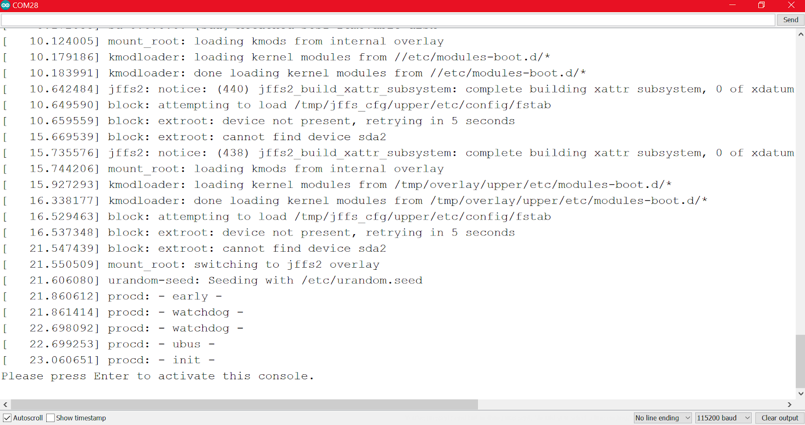
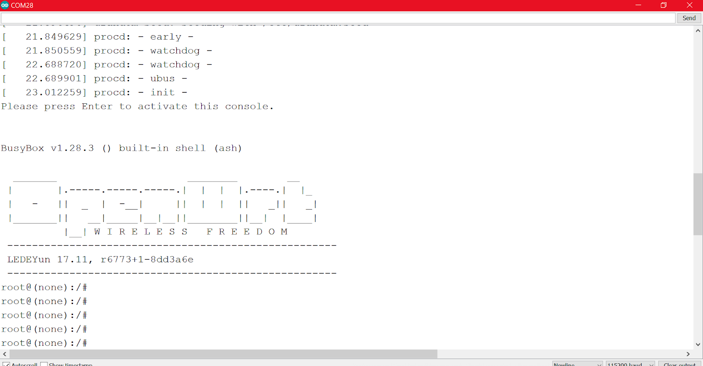

1. Make sure, the `Bridge` library is updated with the latest version. If not, go to Arduino IDE top menu: *Sketch > Include Library > Manage Libraries*, search for 'Bridge' and update it.

2. Go to *File > Examples > Bridge> YunSerialTerminal*.

   

3. Upload this sketch and open the serial monitor.

4. Change the baud rate to 115200. After a few seconds, press the Enter button to activate the console.

   

   

5. Send the opkg commands in Openwrt platform to install the python packages:

   * `opkg update
   * `opkg upgrade`
   * `opkg install python`
   * `opkg install python-pip`
