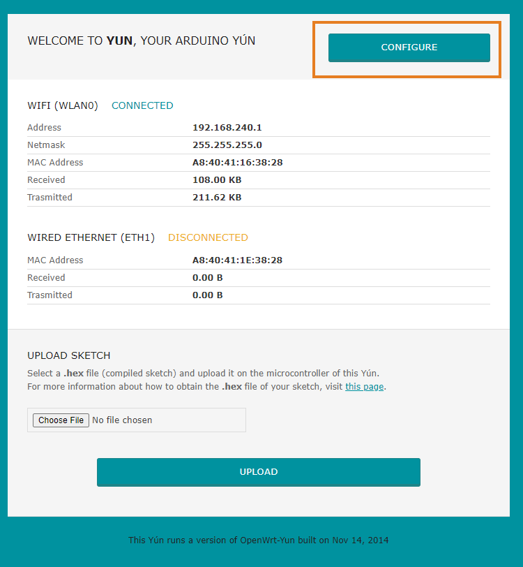

These instructions walk you through connecting your Yún to its web portal. Yún Rev 2 can also connect to an existing network, so once connected you will be able to upload sketches in Hex format as well as configure the Wi-Fi network you want your Yún to connect to. Arduino Yún can connect to unencrypted networks, as well as networks that support WEP, WPA, and WPA2 encryption.

## Steps

Follow the instructions below to access Arduino Yún web portal:

1. When you first power on the Yún, it will create a Wi-Fi network called ArduinoYun-XXXXXXXXXXXX. Connect your computer to this network.

   > If the Yún's Wi-Fi access point does not appear, press and hold the button WLAN-RST for 5 seconds. This will reset the Wi-Fi configuration and the Yún's access point will show up.

2. Once connected to the access point, open a web browser and enter `http://arduino.local` or 192.168.240.1 in the address bar. After a few moments, a web page will appear asking for a password. Enter "arduino" and click the Log In button.

   

3. Now you are in Yún's Web Portal.

   On the main page you will find some diagnostic information about the current network connections. The first one is your Wi-Fi interface, the second one is your ethernet connection and the third option allows you to upload `.hex` sketches to the board remotely.

4. If you press the `Configure` button you will start with the Wi-Fi configuration.

   

   There you can configure all different wireless parameters of the network your Yún will be connecting to. It is also possible to rename your board and to update the password.

   
