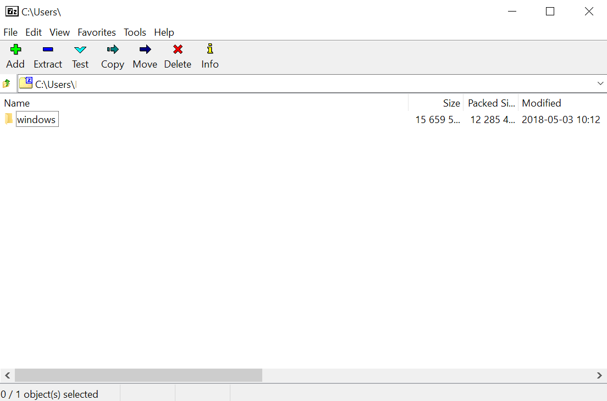

The following procedure updates your Yún board to the latest firmware.

Although the update has been thoroughly tested there is a remote chance of making the board unusable. As the bootloader needs to be reflashed this delicate process can BRICK your board if something unpredictable happens. Therefore Arduino cannot assume the responsibility for any irreversible misconfiguration or bricked board thus following this procedure will void the warranty. Please read and understand this document before trying anything mentioned below. If you are in doubt about any of these steps, DO NOT follow this guide.

**_WARNING_: Following this procedure will VOID the WARRANTY of your Yún**

## Steps

The package that contains everything needed for the procedure is available and it is specific for every supported operating system. To begin, follow the below steps to download and extract the package.

### 1. Download the package

Download the corresponding package for your operating system.

* [Windows](https://downloads.arduino.cc/openwrtyun/17.11/yun-go-updater-windows.zip)
* [macOS](https://downloads.arduino.cc/openwrtyun/17.11/yun-go-updater-osx.tar.gz)
* [Linux64](https://downloads.arduino.cc/openwrtyun/17.11/yun-go-updater-linux64.tar.gz)
* [Linux32](https://downloads.arduino.cc/openwrtyun/17.11/yun-go-updater-linux32.tar.gz)
* [LinuxARM](https://downloads.arduino.cc/openwrtyun/17.11/yun-go-updater-linuxarm.tar.gz)

### 2. Extract the package

   Extract the files using your preferred extraction software. As result, you will obtain a folder named as your OS which contains two other folders and an executable.

   

### 3. Launch the updater

   Run the executable file with admin rights. This step initiates the procedure and should open a CLI window. In our example we are using Windows OS. The script tries to find your IP addresses of the pc and of the board, but the USB connection will be used for the various upgrade operations.

   

### 4. Run the update

   Type 'Y' in the command prompt to answer 'yes' to the first question. Then press ENTER to proceed with the update.

   

### 5. Board Reset

   Reset your Yún board (YUN RST button) as instructed by the procedure and wait for the bootloader flashing and image uploading.

   

   At the end of the whole process the CLI window will close or become inactive.

### 6. Run first configuration

   Your Yún board should be now with the latest OpenWRT (17.11 or newer) and you may go back to the [Getting Started Guide](https://www.arduino.cc/en/Guide/ArduinoYunRev2#resetting-the-processors-ar9331-wifi-and-32u4) and follow the instructions to configure for the first time the new image.
