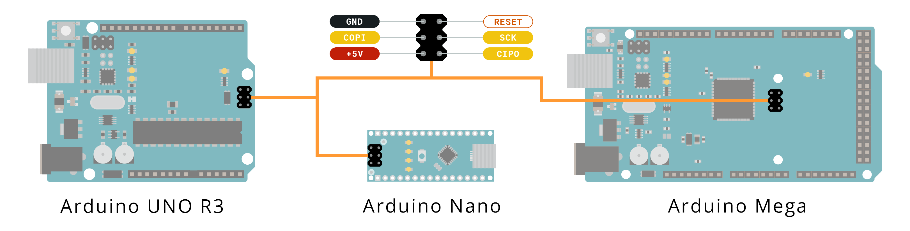
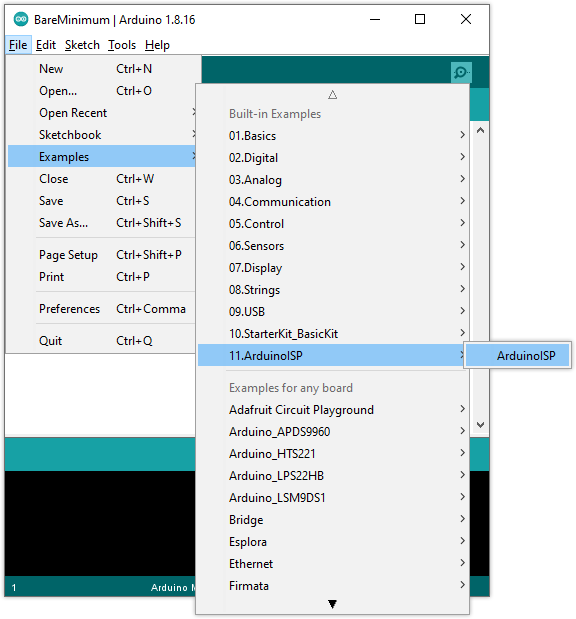
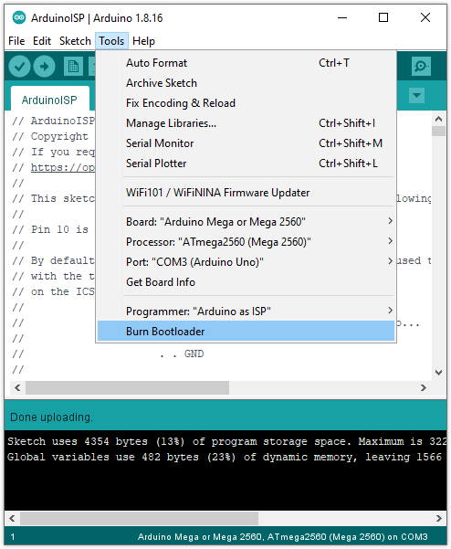
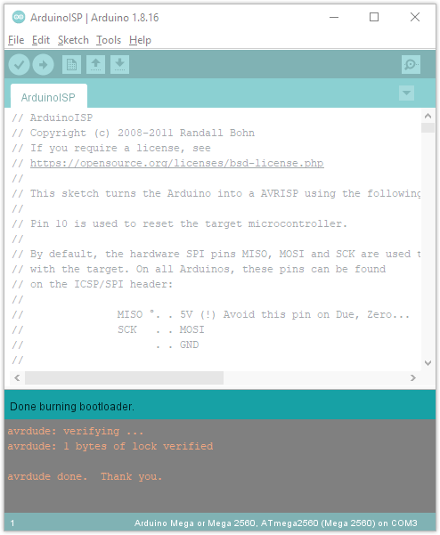

The bootloader is a small piece of software that allows uploading of sketches onto the Arduino board. It comes preprogrammed on the microcontrollers on Arduino boards. Whether the bootloader has been corrupted or intentionally has been removed, it can be restored by _burning_ (also called, _flashing_ or _programming_) a new bootloader to the board.

The easiest way to burn the bootloader to classic AVR boards (UNO, Mega, Nano, etc.) is using **a second Arduino board** as a programmer, which is the method that will be covered below.

---

## Step 1: Connect the boards

AVR boards are programmed with the SPI interface (COPI, CIPO and SCK signals). On many boards (including UNO, Mega, and Nano), these are available in two locations:

* [The digital and power pins](#common-pins). These are the most commonly used pins on Arduino, and you'll only need six standard male-to-male jumper wires.
* [The ICSP header](#icsp). CIPO, COPI, and SCK are available in a consistent physical location on the ICSP header. You'll need female-to-female jumper cables for these pins.

> **Note:** Although the “Arduino as ISP” only works for programming targets of the AVR architecture, you can use boards of any architecture as an “Arduino as ISP” programmer. Check the pinout diagrams in [Arduino Docs](https://docs.arduino.cc/) to find which pins to use for CIPO, COPI, and SCK. On some boards PIN 10 may not be available. In this case, change the line `#define RESET 10` to use a different pin.

<a id="common-pins"></a>

### Option A: Using the digital and power pins

For each row in the table below, connect the programmer pin to the corresponding target pin.

<table class="tg" style="border-collapse: collapse;border-spacing: 0;">
<thead>
  <tr>
    <th class="tg-mqa1" style="border-color: #000000;border-style: solid;border-width: 1px;font-family: Arial, sans-serif;font-size: 14px;font-weight: bold;overflow: hidden;padding: 10px 5px;word-break: normal;text-align: center;vertical-align: top;">PROGRAMMER BOARD</th>
    <th class="tg-mqa1" style="border-color: #000000;border-style: solid;border-width: 1px;font-family: Arial, sans-serif;font-size: 14px;font-weight: bold;overflow: hidden;padding: 10px 5px;word-break: normal;text-align: center;vertical-align: top;">TARGET BOARD</th>
  </tr>
</thead>
<tbody>
  <tr>
    <td class="tg-yrcx" style="border-color: #000000;border-style: solid;border-width: 1px;font-family: Arial, sans-serif;font-size: 14px;overflow: hidden;padding: 10px 5px;word-break: normal;background-color: #ff6633;color: #ffffff;text-align: center;vertical-align: top;">PIN 10</td>
    <td class="tg-rr0h" style="border-color: #000000;border-style: solid;border-width: 1px;font-family: Arial, sans-serif;font-size: 14px;overflow: hidden;padding: 10px 5px;word-break: normal;background-color: #efefef;color: #fe0000;text-align: center;vertical-align: top;">RESET</td>
  </tr>
  <tr>
    <td class="tg-ejxt" rowspan="3" style="border-color: #000000;border-style: solid;border-width: 1px;font-family: Arial, sans-serif;font-size: 14px;overflow: hidden;padding: 10px 5px;word-break: normal;background-color: #ffc702;text-align: center;vertical-align: top;"><span style="font-weight:bold">COPI</span><br>UNO: PIN 11<br>Nano: PIN 11<br>Mega: PIN 51</td>
    <td class="tg-ejxt" rowspan="3" style="border-color: #000000;border-style: solid;border-width: 1px;font-family: Arial, sans-serif;font-size: 14px;overflow: hidden;padding: 10px 5px;word-break: normal;background-color: #ffc702;text-align: center;vertical-align: top;"><span style="font-weight:bold">COPI</span><br>UNO: PIN 11<br>Nano: PIN 11<br>Mega: PIN 51</td>
  </tr>
  <tr>
  </tr>
  <tr>
  </tr>
  <tr>
    <td class="tg-xawf" rowspan="3" style="border-color: #000000;border-style: solid;border-width: 1px;font-family: Arial, sans-serif;font-size: 14px;overflow: hidden;padding: 10px 5px;word-break: normal;background-color: #FFC702;text-align: center;vertical-align: top;"><span style="font-weight:bold">CIPO</span><br>UNO: PIN 12<br>Nano: PIN 12<br>Mega: PIN 50</td>
    <td class="tg-ejxt" rowspan="3" style="border-color: #000000;border-style: solid;border-width: 1px;font-family: Arial, sans-serif;font-size: 14px;overflow: hidden;padding: 10px 5px;word-break: normal;background-color: #ffc702;text-align: center;vertical-align: top;"><span style="font-weight:bold">CIPO</span><br>UNO: PIN 12<br>Nano: PIN 12<br>Mega: PIN 50</td>
  </tr>
  <tr>
  </tr>
  <tr>
  </tr>
  <tr>
    <td class="tg-ejxt" rowspan="3" style="border-color: #000000;border-style: solid;border-width: 1px;font-family: Arial, sans-serif;font-size: 14px;overflow: hidden;padding: 10px 5px;word-break: normal;background-color: #ffc702;text-align: center;vertical-align: top;"><span style="font-weight:bold">SCK</span><br>UNO: PIN 13<br>Nano: PIN 13<br>Mega: PIN 52</td>
    <td class="tg-ejxt" rowspan="3" style="border-color: #000000;border-style: solid;border-width: 1px;font-family: Arial, sans-serif;font-size: 14px;overflow: hidden;padding: 10px 5px;word-break: normal;background-color: #ffc702;text-align: center;vertical-align: top;"><span style="font-weight:bold">SCK</span><br>UNO: PIN 13<br>Nano: PIN 13<br>Mega: PIN 52</td>
  </tr>
  <tr>
  </tr>
  <tr>
  </tr>
  <tr>
    <td class="tg-29y7" style="border-color: #000000;border-style: solid;border-width: 1px;font-family: Arial, sans-serif;font-size: 14px;overflow: hidden;padding: 10px 5px;word-break: normal;background-color: #ff0000;color: #ffffff;text-align: center;vertical-align: top;">5V</td>
    <td class="tg-ru72" style="border-color: #000000;border-style: solid;border-width: 1px;font-family: Arial, sans-serif;font-size: 14px;overflow: hidden;padding: 10px 5px;word-break: normal;background-color: #fe0000;color: #ffffff;text-align: center;vertical-align: top;"><span style="font-weight:400;font-style:normal">5V</span></td>
  </tr>
  <tr>
    <td class="tg-5hz4" style="border-color: #000000;border-style: solid;border-width: 1px;font-family: Arial, sans-serif;font-size: 14px;overflow: hidden;padding: 10px 5px;word-break: normal;background-color: #330001;color: #ffffff;text-align: center;vertical-align: top;">GND</td>
    <td class="tg-5hz4" style="border-color: #000000;border-style: solid;border-width: 1px;font-family: Arial, sans-serif;font-size: 14px;overflow: hidden;padding: 10px 5px;word-break: normal;background-color: #330001;color: #ffffff;text-align: center;vertical-align: top;"><span style="font-weight:400;font-style:normal">GND</span></td>
  </tr>
</tbody>
</table>

When the boards are connected, you can proceed with [burning the bootloader in Arduino IDE](#ide).

<figure style="width: 500px; margin: 0;">
    
    <figcaption style="text-align: center; font-style: italic;">Example: Using an UNO to program a Nano (digital and power pins).</figcaption>
</figure>

<a id="icsp"></a>

### Option B: Using the ICSP header pins

_Note that the orientation of the header relative to the USB port is different on the Nano._

1. Connect every programmer ICSP pin except RESET to the equivalent ICSP pin on the target.
2. Connect PIN 10 on the programmer board to any RESET pin on the target.

<figure style="width: 400px; margin: 0;">
    
    <figcaption style="text-align: center; font-style: italic;">Example: Using an UNO to program a Mega (ICSP pins).</figcaption>
</figure>

---

<a id="ide"></a>

## Step 2: Burn the bootloader in Arduino IDE

Now that the board connections are set up, we can use Arduino IDE to burn the bootloader.

01. Open Arduino IDE.

02. Connect the **programmer board** to the computer.

03. Select your programmer board in _Tools > Board_, for example _Tools > Board > Arduino AVR Boards > Arduino Uno_.

04. Select the port the board is connecting to in _Tools > Port_.

05. Open _File > Examples > 11.ArduinoISP > ArduinoISP_.

    

06. Click  **Upload** to upload the sketch to the board.

07. Select the **target board** in _Tools > Board_.

08. Select _Tools > Programmer > Arduino as ISP_.

09. We can now start the burning process. It's a good idea to enable [verbose upload output](https://support.arduino.cc/hc/en-us/articles/4407705216274) in preferences since there will be no console output during the process otherwise. To start the process, select _Tools > Burn Bootloader_.

    

10. Wait for the process to complete, which may take up to a minute. When it's finished, the message "Done burning bootloader" will appear on top of the console, or in a bottom-right notification pop-up, depending on your IDE version.

    

---

## Troubleshooting

### Error: Missing programmer

```
avrdude: Yikes!  Invalid device signature.
         Double check connections and try again, or use -F to override
         this check.

Error while burning the bootloader: Failed chip erase: uploading error: exit    status 1
```

Check your selection in _Tools > Programmer_.

### Error: Failed chip erase: uploading error: exit status 1

```
Error while burning the bootloader: Failed chip erase: uploading error: exit status 1
```

* Make sure you've selected the target board in _Tools > Board_.
* Make sure you've connected the RESET pin correctly.

### avrdude: Error: Could not find USBtiny device

```
Error while burning bootloader.
avrdude: Error: Could not find USBtiny device (0x2341/0x49)

```

Make sure you've selected **Arduino as ISP** in _Tools > Programmer_, and **not** ArduinoISP or other similar options.

---

## Further reading

* [Bootloader (Arduino Docs)](https://docs.arduino.cc/hacking/software/Bootloader)
* [Arduino as ISP and Arduino Bootloaders](https://docs.arduino.cc/built-in-examples/arduino-isp/ArduinoISP). Some information is not up to date (no capacitor is needed for the Mega 2560 Rev3).
