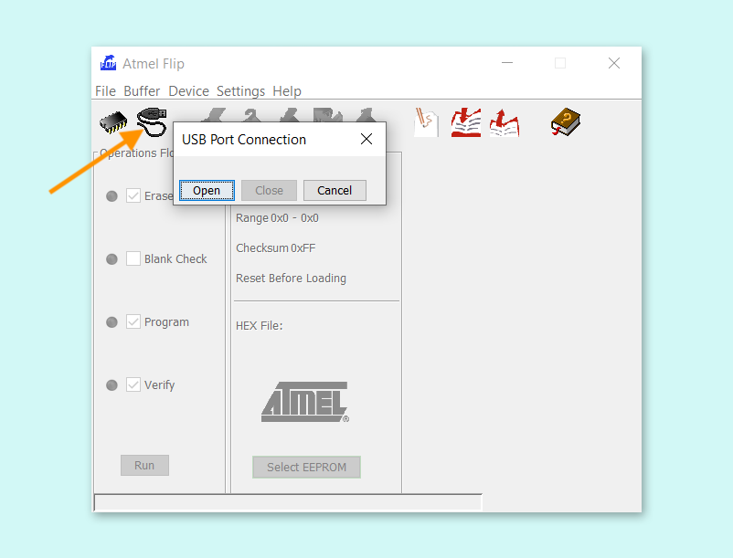
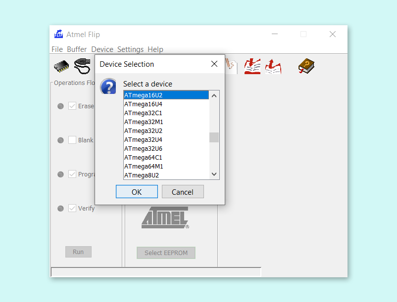
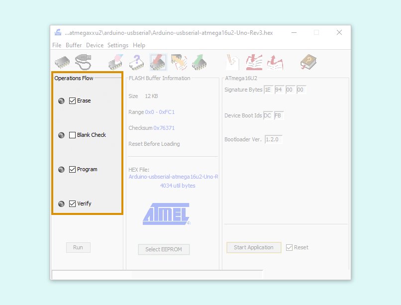
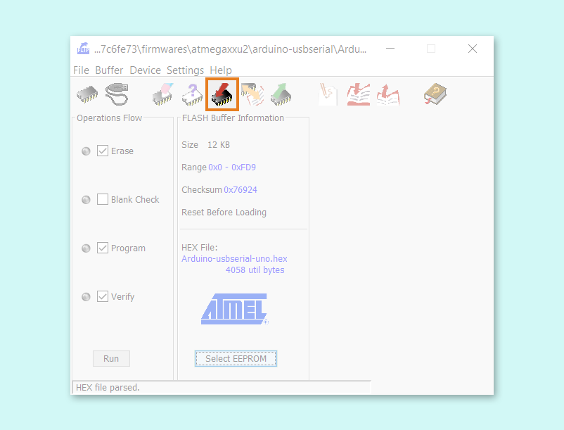
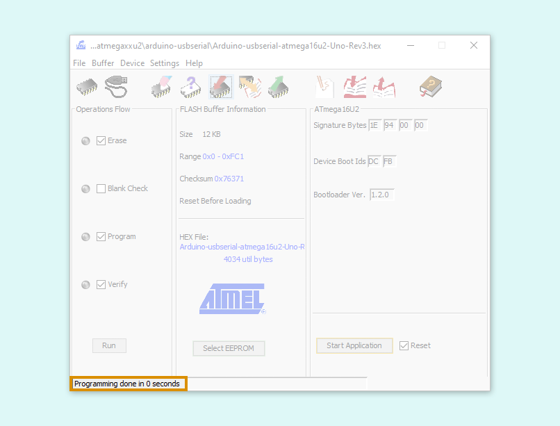
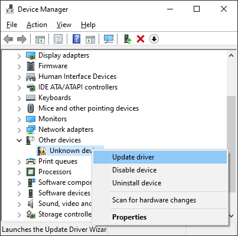
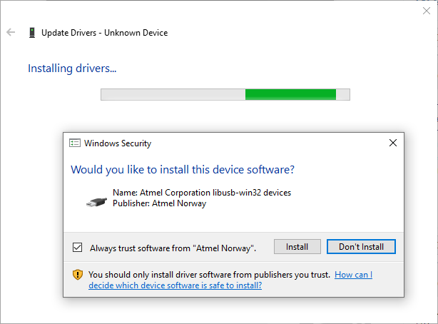
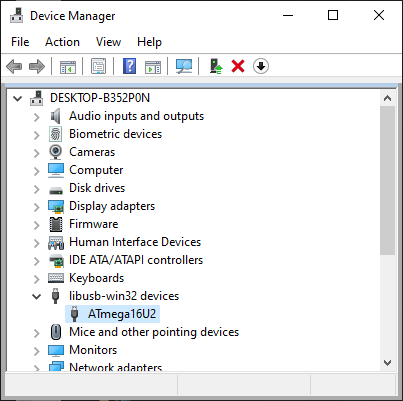

The following boards use either an Atmega16U2 or Atmega8U2 chip as a USB-to-serial converter:

* Arduino UNO
* Arduino UNO Rev3
* Arduino Mega
* Arduino Mega2560 Rev3
* Arduino MegaADK Rev3

The converter chip firmware can be flashed with a computer by setting the board to **DFU mode** (Device Firmware Update).

> Note that this article does _not_ apply to the Uno WiFi Rev2, which uses a different chip with closed source firmware.

## 1. Get the firmware

The firmware is included in the **Arduino AVR Boards** platform. The platform comes installed with Arduino IDE by default, and can be found in the [Arduino15 directory](https://support.arduino.cc/hc/en-us/articles/360018448279-Where-can-I-find-the-Arduino15-folder-): `Arduino15/packages/arduino/hardware/avr/<version>`. Alternatively, you can download and extract the repository from the [GitHub page](https://github.com/arduino/ArduinoCore-avr) (Code > Download ZIP).

Within the platform directory, the usb to serial firmware is found in `firmwares/atmegaxxu2/arduino-usbserial`. Select the firmware for your board, most likely one of the following:

| Board                 | Firmware                                       |
|-----------------------|------------------------------------------------|
| Arduino Mega2560 Rev3 | Arduino-usbserial-atmega16u2-Mega2560-Rev3.hex |
| Arduino MegaADK Rev3  | Arduino-usbserial-atmega16u2-MegaADK-Rev3.hex  |
| Arduino UNO Rev3      | Arduino-usbserial-atmega16u2-Uno-Rev3.hex      |
| Arduino UNO           | Arduino-usbserial-uno.hex                      |
| Arduino Mega          | Arduino-usbserial-mega.hex                     |

## 2. Program the chip with the firmware

### Using dfu-programmer (macOS/Linux)

1. Download **dfu-programmer** from the [project website](https://dfu-programmer.sourceforge.io/) or install the `dfu-programmer` package using a package manager like [homebrew](https://brew.sh/index) (macOS) or [apt-get](https://manpages.ubuntu.com/manpages/kinetic/en/man8/apt-get.8.html) (Ubuntu).

2. Connect the board to your computer.

3. [Set the board to DFU mode](https://support.arduino.cc/hc/en-us/articles/4410804625682).

4. Open Terminal.

5. Identify the chip model by trying the following commands:

   ```
   dfu-programmer atmega16u2 read
   ```

   ```
   dfu-programmer atmega8u2 read
   ```

   > **Note:** For older versions of dfu-programmer, replace `read` with `dump` for the commands above.

   One of these command should read the memory successfully, and print it to terminal or indicate if it's empty. Use the name from the successful command in the following steps.

6. Erase the memory.

   `dfu-programmer <atmegaxxu2> erase`

7. Flash the firmware.

   `dfu-programmer <atmegaxxu2> flash <firmware path>`

8. Disconnect and reconnect the board to your computer.

### Using FLIP (Windows)

1. Connect the board to your computer.

2. [Set the board to DFU mode](https://support.arduino.cc/hc/en-us/articles/4410804625682).

3. Open Device Manager.

4. Expand the **libusb-win32-devices** category. If it is missing, [follow these steps](#install-libusb-win32) before proceeding.

5. Take a note of the device name, which should be either **ATmega16U2** and **ATmega8U2**.

Next we'll flash the drivers using FLIP.

01. Download and install [FLIP](https://www.microchip.com/en-us/development-tool/flip).

02. Open FLIP.

    > Opening the application may prompt a 'Could not find a Java Virtual Machine' error. In this case, [install Java Runtime Environment](https://www.java.com/en/download/manual.jsp) with the **Windows Online** option.

03. Select the device name you identified earlier (ATmega16U2 or ATmega8U2).

04. Click the Cable button, select USB, then click Open.

    

05. In the menu, click _Device > Select..._

    

06. Click _File > Load HEX File..._

07. Select your driver `.hex` file and click 'OK'.

08. For Operational Flow, check check **Erase**, **Program**, and **Verify** (this is the default setting).

    

09. Click on the 'Program Target Device Memory' button.

    

10. The firmware will be flashed, which may happen very quickly. A "Programming done" message should be displayed in the bottom-left corner.

    

11. Disconnect and reconnect the board to your computer.

<h2 id="install-libusb-win32">Install the libusb-win32 driver in Device Manager (Windows)</h2>

1. Look for an **Unknown Device** under 'Other Devices'. Disconnect all devices except the board if multiple unknown devices are available.

2. Right-click and select **Update driver**.

   

3. Point to `C:\Program Files (x86)\Atmel\Flip 3.4.7`

4. Click 'Install' and wait for the installation to complete.

   

5. The device should now be recognized, under 'libusb-win32-devices'

   
