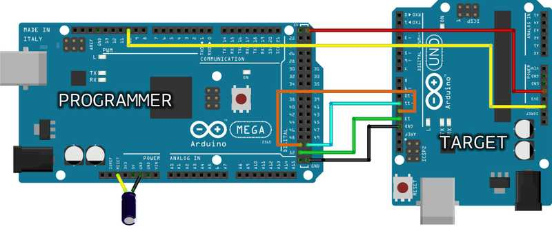

The bootloader is a piece of code stored in a reserved space in your Arduino board's memory. It initiates the sketch when the board is powered and allows new sketches to be uploaded from your PC. This tutorial explains how to burn the bootloader to an Arduino Uno using an Arduino Mega.

---

## What you'll need

* Arduino Mega
* Arduino Uno
* 10uF capacitor (For older version of Mega)
* USB 2.0 cable x 1
* Jumper cables x 6nos

## Instructions

01. Connect Arduino Mega to your PC. Open Arduino IDE.

02. Select _Tools > Board > Arduino AVR Boards > Arduino Mega or Mega 2560_.

03. Open the `ArduinoISP` sketch from the menu bar: _File > Examples > 11.Arduino ISP > ArduinoISP_

04.  **Upload** the sketch.

05. Disconnect Arduino Mega from your PC.

06. Connect the boards as follows:

    

    | PROGRAMMER PINS | TARGET PINS |
    |:---------------:|:-----------:|
    | PIN 10          | RESET       |
    | PIN 51          | PIN 11      |
    | PIN 50          | PIN 12      |
    | PIN 52          | PIN 13      |
    | 5V              | 5V          |
    | GND             | GND         |

    > Note: For the latest models of Arduino Mega the additional 10uF capacitor between the Reset and GND is not required.

07. Connect Arduino Mega to your PC again.

08. Select _Tools > Board > Arduino AVR Boards > Arduino Uno_.

09. Select _Arduino as ISP_ in _Tools > Programmer_.

10. Select _Tools > Burn Bootloader_.

11. Wait for the process to finish. When it's complete, `avrdude done. Thank you.` will be printed to console.
