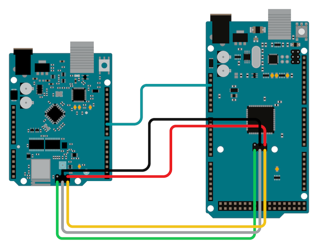

The bootloader is a piece of code stored in a reserved space in your Arduino board's memory. It initiates the sketch when the board is powered and allows new sketches to be uploaded from your PC. This tutorial explains how to burn the bootloader to an Arduino Mega using an Arduino Uno.

## Requirements

* Arduino Mega 2560 as a target board x 1
* Arduino UNO as a programmer board x 1
* Jumper wires x 6
* USB 2.0 cable x 1
* PC with Arduino IDE installed

## Burning the bootloader

01. Connect the Arduino Uno to your computer.

02. In Arduino IDE; select `Tools > Board > Arduino AVR Boards > Arduino Uno`.

03. Select the port your board is connected to in `Tools > Port`.

04. Open the `ArduinoISP` sketch:

    * Windows/Linux: `File > Examples > 11.Arduino ISP > ArduinoISP`
    * macOS: `Arduino > Examples > 11.Arduino ISP > ArduinoISP`

05. Click  **Upload** to upload the sketch to the board.

06. Disconnect the Uno from the PC.

07. Connect the two boards as follows using the ICSP pins on each board:

    

    | PROGRAMMER ICSP PINS | TARGET ICSP PINS |
    |:---------------------:|:---------------:|
    | PIN 10                | RESET           |
    | ICSP-4                | ICSP-4          |
    | ICSP-1                | ICSP-1          |
    | ICSP-3                | ICSP-3          |
    | ICSP-2                | ICSP-2          |
    | ICSP-6                | ICSP-6          |

08. Connect the Arduino Uno to your PC again.

09. Check the port selection like in step 2 and 3.

10. Change the board to Arduino Mega or Mega 2560.

11. Select `Tools > Programmer > Arduino as ISP`.

12. Select `Tools > Burn Bootloader`.

    The following confirmation message will show at the bottom of Arduino IDE if successful:

    

> **Note:** You can also connect the boards using the I/O pins on each board. For example, 1 - CIPO ICSP is internally connected to the same electric node as I/O PIN 12 and so on. So it doesn't matter which connection type you use (I/O pins or ICSP) as long as they follow one of the tables.

| PROGRAMMER PINS | TARGET PINS |
|:---------------:|:-----------:|
| PIN 10          | RESET       |
| PIN 11          | PIN 51      |
| PIN 12          | PIN 50      |
| PIN 13          | PIN 52      |
| 5V              | 5V          |
| GND             | GND         |
