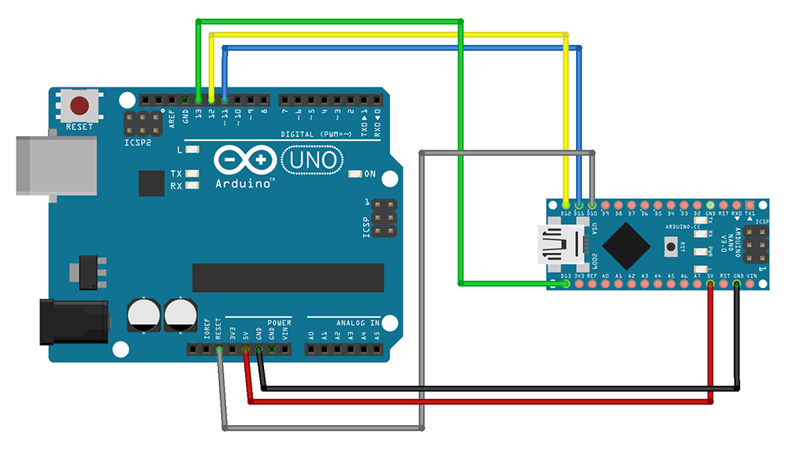

The bootloader is a piece of code stored in a reserved space in your Arduino board's memory. It initiates the sketch when the board is powered and allows new sketches to be uploaded from your PC. This tutorial explains how to burn the bootloader to an Arduino Uno using an Arduino Nano.

---

## What you'll need

* Arduino Nano
* Arduino Uno
* USB Cable Type A Male to Micro Type B Male
* Jumper cables x 6nos

## Instructions

01. Open Arduino IDE.

02. Connect Arduino Nano to your PC.

03. Select Arduino Nano in _Tools > Board > Arduino AVR Boards_.

04. Open the `ArduinoISP` sketch from the menu bar: _File > Examples > 11.ArduinoISP > ArduinoISP_

05.  **Upload** the sketch.

06. Disconnect Arduino Nano board from your PC.

07. Connect the boards as follows:

    

    | Programmer Pin | Target Pin |
    |----------------|------------|
    | D10 SS         | Reset      |
    | 5V             | 5V         |
    | GND            | GND        |
    | D11 COPI       | D11 COPI   |
    | D12 CIPO       | D12 CIPO   |
     D13 SCK        | D13 SCK    |

08. Connect Arduino Nano to your PC again.

09. Select _Arduino as ISP_ in _Tools > Programmer_.

10. Select _Tools > Burn Bootloader_.

11. Wait for the process to finish. When it's complete, `avrdude done. Thank you.` will be printed to console.
