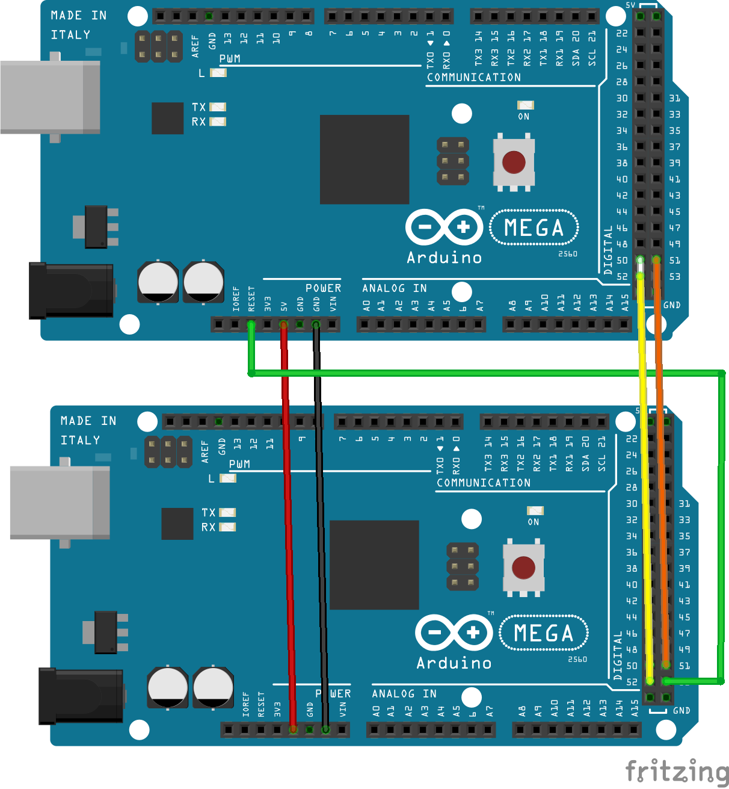

This is a tutorial that explains how to burn the bootloader using 2 Arduino Mega. You can do this when the board suddenly stops working after using the board for a while and also as a last resort to see if the new board you got is a faulty board.

## Components required

* Arduino Mega 2560 - 2
* Jumper wires - 6
* USB 2.0 cable - 1

## Steps to follow

1. Choose the working board as your programmer.

2. Make the connections according to the below table

   | Controller (Pin number)  | Peripheral (Pin number)  |
   |:-----------------------: |:-----------------------: |
   | 50 - CIPO                | 50 - CIPO                |
   | 51 - COPI                | 51- COPI                 |
   | 52 - SCK                 | 52 - SCK                 |
   | **53 - SS**              | **RESET PIN**            |

   

3. Open Arduino IDE.

4. Click on *File > Examples > Arduino ISP*.

5. In the *ArduinoISP* example, make the following changes according to the pin connection.

   [Code snippet](https://create.arduino.cc/example/builtin/11.ArduinoISP%5CArduinoISP/ArduinoISP/preview?embed&snippet=L68-L89&hidenumbers#L73,L85-L87)

6. Make sure the board selected is mega 2560 and the correct port is selected, then upload the code.

7. After uploading the code. Go to `Tools > Programmer > 'Arduino as ISP'`.

8. Go to `Tools > Burn Bootloader`. It will take few minutes to be done.
