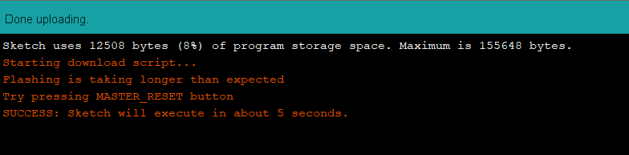
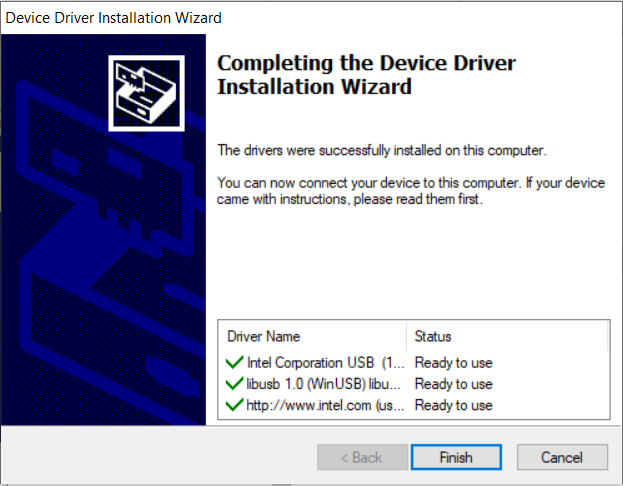

Before continuing troubleshooting with this article, make sure you have installed the 101 board with the latest version of the Intel Curie drivers according to the instructions on the [CTC 101 Platform](https://create.arduino.cc/ctc/101/course/view.php?id=250&section=15) (Log in is required).

## Issues and error messages

* Port is grayed out
* Console error message: `ERROR: Timed out waiting for Arduino 101 on COM#`

## Cause: The drivers are not properly installed

On Windows PCs, the issue can appear when the driver is not being properly or completely installed. If the time to install the driver is more than the 5 seconds, the boards firmware will abort the process and no driver is installed.

### Solution 1: Pressing the HARD RESET button

To solve this issue, press the HARD RESET button when asked to in the bottom console area.

1. Upload the sketch and read the output bottom console area (If the port is grayed out, upload the sketch without selecting the port).

    

2. Locate the HARD RESET button between the USB outlet and the power outlet. Press when asked to in the console area.

    

3. The sketch should upload successfully and "Done uploading" will be shown in the teal area above the output console.

    

### Solution 2: Install the drivers manually

Sometimes the issue happens when the drivers are not installed, even though the board manager claims to have the latest version of the Intel Curie driver installed.

To check this, install the drivers manually again after installing it from the boards manager:

1. Locate the installation file in its folder:
   `C:\Users\<USERNAME>\AppData\Local\Arduino15\packages\Intel\hardware\arc32\<VERSION>\drivers`

   > Note that the folder Arduino15 might be hidden.

2. Run the installation file `dpinst-amd64` or `dpinst-x86` depending on your system.

3. Follow the Device Driver Installation Wizard.

   When finished, the Installation Wizard should say *The drivers were successfully installed on this computer* followed by three green checks.

   

   After successfully installing the drivers manually, you still might have to go through the HARD RESET procedure above for the first upload.

### I tried all above and it didn’t work

In case the wizard is not installing the drivers successfully, there can be two reasons:

1. The user lacks privileges to install the drivers on the computer. In this case you need to contact your IT Admin.

2. Your computer is not accepting the driver signature. In this case, please contact us through the [contact us form](https://www.arduino.cc/en/contact-us).

## Further reading

* [Getting Started with the Arduino 101](https://www.arduino.cc/en/Guide/Arduino101#use-your-arduino-101-on-the-arduino-web-ide)
* [CTC 101 Platform: Installing the 101 board](https://create.arduino.cc/ctc/101/course/view.php?id=250&section=15) (Log In is required)
