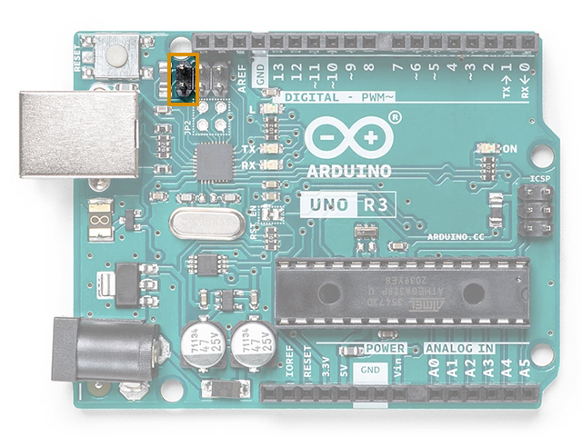
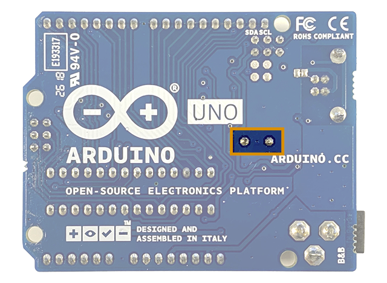

UNO (except WiFi Rev2) and Mega boards use either an Atmega16U2 or Atmega8U2 chip as a USB-to-serial converter. By setting a board to **DFU mode** you can [upload USB-to-Serial firmware to the chip](https://support.arduino.cc/hc/en-us/articles/4408887452434-Flash-USB-to-serial-firmware-in-DFU-mode).

1. Connect the board to your computer

2. Find the RESET and GND pins for the ATmega USB-Serial Processor. They are the innermost two pins of the six located close to the USB port.

   

3. Briefly short the pins (follow [these instructions](#rev1) for UNO Rev1)

The board will reset to DFU mode.

<h2 id="rev1">Short the HWB line (Rev1 models)</h2>

If you're using an Rev1 model, you also need to assert and hold the **HWB line**:

1. Find the two HWB pads on the back of the board.

   

2. Assert the line by shorting the two pads, e.g. with a piece of wire.

3. Short the RESET + GND pins.

4. Release the RESET + GND pins.

5. Release the HWB line.

The board will reset to DFU mode.

## Further reading

* [Flash USB-to-Serial firmware in DFU mode](https://support.arduino.cc/hc/en-us/articles/4408887452434-Flash-USB-to-serial-firmware-in-DFU-mode).
