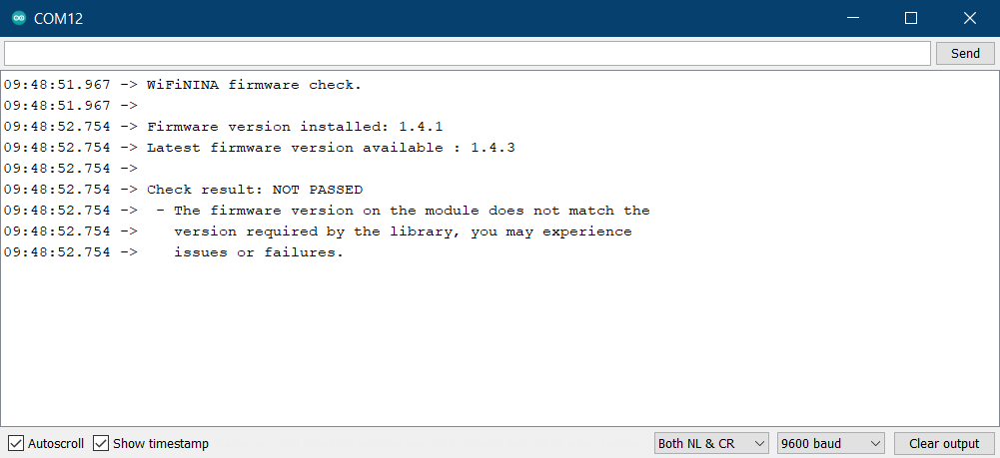
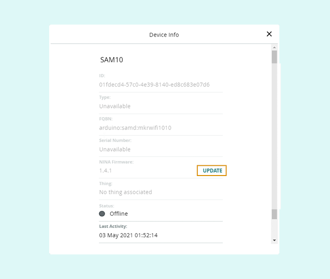

Learn how to check the firmware for WiFiNINA and WiFi101 modules, and update it using the Firmware Updater tool.

---

## Arduino IDE

### Check which firmware is used

Boards with the **WiFiNINA** module:

* [Arduino MKR WiFi 1010](https://store.arduino.cc/arduino-mkr-wifi-1010)
* [Arduino MKR Vidor 4000](https://store.arduino.cc/arduino-mkr-vidor-4000)
* [Arduino Nano 33 IoT](https://store.arduino.cc/arduino-nano-33-iot)
* [Arduino Uno WiFi Rev2](https://store.arduino.cc/arduino-uno-wifi-rev2)

Boards with the **WiFi101** module:

* [Arduino MKR1000](https://store.arduino.cc/arduino-mkr1000-wifi)

### Check the firmware version

We can check the current firmware version by uploading a sketch to the board that will report the version via the serial monitor.

1. Connect the board to your computer and start Arduino IDE.

2. The **WiFiNINA** or **WiFi101** library needs to be installed, depending on the module. Open the Library Manager (`Tools > Manage Libraries...` and make sure it's installed. For help with library installation, see [this guide](https://www.arduino.cc/en/guide/libraries).

3. With the library installed, open the firmware checking sketch:

   * **WiFiNINA (Windows):** `File > Example > WiFiNINA > Tools > Select ‘CheckFirmware Version’`
   * **WiFiNINA (macOS/Linux):** `Arduino > Example > WiFiNINA > Tools > Select ‘CheckFirmware Version’`
   * **WiFi101 (Windows):** `File > Example > WiFi101 > CheckWifi101FirmwareVersion`
   * **WiFi101 (macOS/Linux):** `Arduino > Example > WiFi101 > CheckWifi101FirmwareVersion`

4. Choose the port with your board in `Tools > Port > ...`

5. Click  **Upload** to upload the sketch to the board.

6. Open the Serial Monitor (`Tools > Serial Monitor`) and observe the output.

   

If the latest firmware is installed the output will include this line:

```
Check result: PASSED
```

But if a newer firmware version is available the output will look something like this:

```
WiFiNINA firmware check.

Firmware version installed: 1.4.7
Latest firmware version available : 1.4.8

Check result: NOT PASSED
 - The firmware version on the module does not match the
   version required by the library, you may experience
   issues or failures.
```

To update the firmware, follow the instructions below.

## Update the firmware

Updating the firmware can be done using the **Firmware Updater** tool.

1. Connect the board to your computer and make sure the Serial Monitor is not open.

2. Open the Firmware Updater (`Tools > WiFi101 / WiFiNINA Firmware Updater`).

3. *Select port of the WiFi module.* Select your board in the list. If it is not listed, make sure it is connected, and click 'Refresh list'. Finally, click 'Open Updater sketch'.

   

4. Upload the sketch by clicking  **Upload**. Then, go back to the Firmware Updater window from before.

5. *Update firmware.* Select a firmware version in the dropdown. Typically, you will want the latest version (the one with the highest version number, at the top of the list). Finally, click 'Update Firmware'.

   

6. Wait for the firmware update to complete, which may take a minute to complete. A successful update will be confirmed by a pop-up.

## Arduino IoT Cloud

The firmware can also be managed in Arduino IoT Cloud.

### Check the firmware version

1. Open the [Device tab](https://create.arduino.cc/iot/devices).

2. Click the row with your device.

3. See the firmware for NINA or WIFI 101.

   

### Update the firmware

If a new firmware is released for a device added to IoT Cloud:

1. Open the [Device tab](https://create.arduino.cc/iot/devices).

2. Click the row with your device.

3. Click the firmware UPDATE button.

   

Alternatively, you can remove and add the device again. When adding the device the firmware is automatically updated with the latest firmware version.

1. Connect the board to your computer and make sure the Serial Monitor is not open.

2. Open the [Device tab in Arduino IoT Cloud](https://create.arduino.cc/iot/devices).

3. Remove the device if it's been previously added by clicking the three dots, then _Remove_.

4. Click 'Add Device' and follow the instructions for [adding your device](https://support.arduino.cc/hc/en-us/articles/360016495559-How-to-add-Arduino-devices-to-the-Arduino-IoT-cloud).

Your device should be updated with the latest firmware version.
