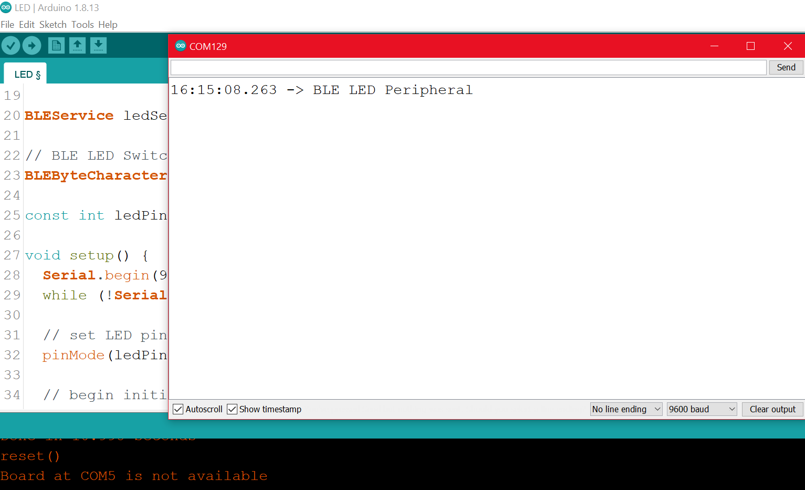
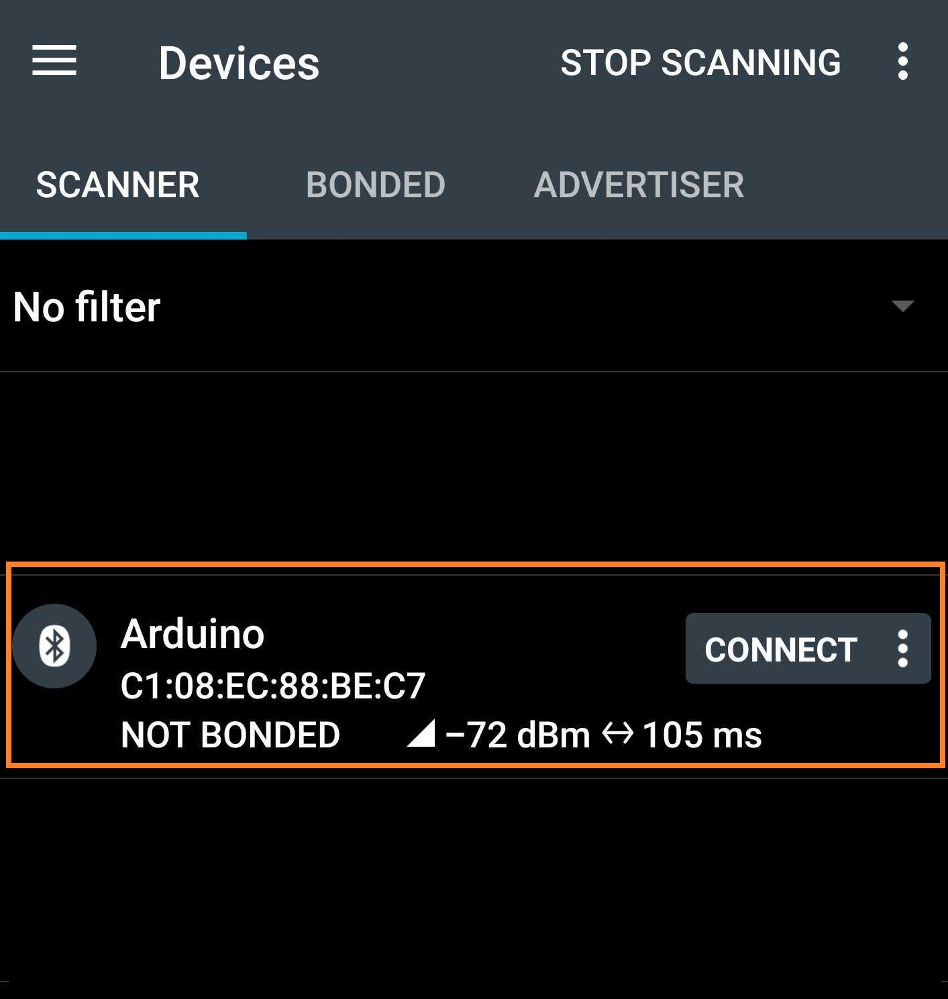

By default, the name of the Arduino BLE board is always the same, this can cause confusion if you would have more than one BLE boards active at the same time, as it would be very hard to track which name depicts which BLE board around you.

We can manually change the name of the Arduino BLE boards from the sketches by defining the name according to your requirements.

## Components required

* Hardware:
  * Arduino BLE board i.e. Nano 33 BLE, Arduino NANO 33 IoT, Uno WiFi Rev 2, MKR WiFi 1010
  * USB 2.0 cable to Micro
  * Device with Bluetooth (Android or iOS)
* Software:
  * Arduino IDE
  * Arduino BLE library
  * Arduino core for Nano 33 BLE(nRF528x, Nano 33 IoT(SAMD boards), UNO WiFi rev2(megaAVR boards), MKR 1010(SAMD boards))
  * NRF connect app

## Steps to follow

1. Open Arduino IDE.

2. Connect the board to the computer and choose the correct board and port in `Tools > Board` and `Tools > Port`.

3. Click on `File > Examples > Arduino BLE > Peripheral > LED`.

4. In the `LED` example, make the following changes in line 42 of the code: change `BLE.setLocalName("LED");` to `BLE.setLocalName("MyNameForTheBoard");` ([code snippet](https://create.arduino.cc/example/library/arduinoble_1_1_3/arduinoble_1_1_3%5Cexamples%5CPeripheral%5CLED/LED/preview)).

5. Upload the code.

6. Open the serial monitor

   

7. Open the NRF connect app from mobile

   

For every board, you can run this example and change their BLE name, just make sure you set a different name for each!
