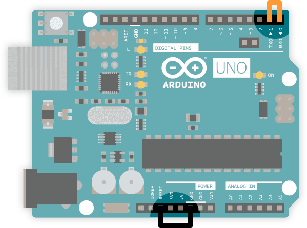
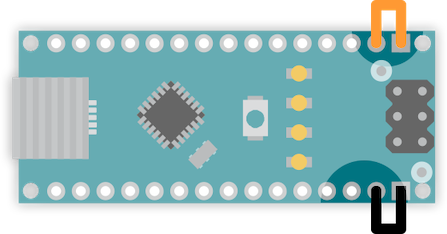

A **loopback test** is a troubleshooting procedure to test the serial communication between the PC and Arduino board with a dedicated USB to Serial converter chip. It can be performed with the following boards:

* Arduino UNO (classic)
* Arduino UNO Rev3 <!-- [X] Tested 2022-03-24 -->
* Arduino UNO Rev3 SMD <!-- [X] Tested 2022-03-24 -->
* Arduino Mega (classic)
* Arduino Mega2560 Rev3
* Arduino Mega ADK Rev3
* Arduino Nano (classic) <!-- [X] Tested 2022-03-24 -->

## Performing the test

1. Disconnect the board from your computer or battery.

2. Remove all shields, jumper cables, and other connections from the board.

3. Connect a jumper cable from **RESET** to **GND**.

4. Connect a jumper cable from **Digital 0 (RX)** to **Digital 1 (TX)**.

   
   _Pin connections for Arduino UNO._

   
   _Pin connections for Arduino Nano._

5. Connect the board to your computer and open the Arduino IDE or the [Arduino Cloud Web Editor](https://create.arduino.cc/editor).

6. Ensure that the correct port is selected.
   * **Arduino IDE:** *Tools > Port > [Your Arduino Board]*
   * **Web Editor:** Select your board using the boards dropdown.

7. Open the Serial Monitor.
   * **Arduino IDE:** *Tools > Serial Monitor*
   * **Web Editor:** Select *Monitor* in the sidebar.

8. Enter a message and click Send. Your message should immediately be echoed by the board, and appear in the output field below.

   

   *Performing a loopback test in the Arduino IDE serial monitor.*

## If the loopback test failed

A failed loopback test failed indicates that the USB to TTL serial adapter is damaged and that the board should be replaced. [Contact us](https://www.arduino.cc/en/contact-us/) for questions about warranty, or visit [the Arduino Store](https://store.arduino.cc/).

> **Note:** This test will always fail for the CH340 USB to serial chip used on some derivate boards.

## If the loopback test passes

A successful loopback test means that the board can communicate with the computer but is unable to upload or run the sketch. This can be the result of a missing or corrupted bootloader. You can burn a new bootloader using another Arduino board as an ISP programmer, see [Burn the bootloader on UNO, Mega, and classic Nano using another Arduino](https://support.arduino.cc/hc/en-us/articles/4841602539164-Burn-the-bootloader-on-UNO-Mega-and-classic-Nano-using-another-Arduino).
