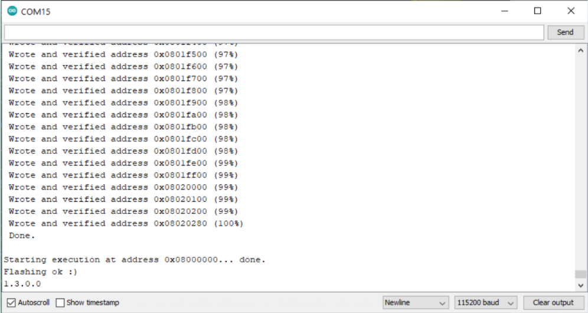

When using the LoRa® functionality in Arduino devices, it is recommended to keep the LoRa® modem firmware updated. This can be done through the Arduino IDE by running a sketch included in the examples from the MKRWAN library (guide valid for MKR WAN 1300, MKRWAN 1310, and Portenta H7 with LoRa Vision Shield).

1. Connect your board (if using the Portenta H7, make sure the LoRa Vision shield is attached)
2. Install/update the `MKRWAN` library from Arduino IDE menu `Tools > Manage Libraries`. Type "MKRWAN" to find the library and click 'Install' or 'Update' if necessary. This library provides all the APIs to communicate with LoRa® and LoRaWAN® networks.
3. Open the `MKRWANFWUpdate_standalone` sketch from the Arduino IDE menu: `File > Examples > MKRWAN`.
4. Upload the sketch.
5. Open the Serial Monitor (`Tools > Serial Monitor`) and wait for the update to be completed.

