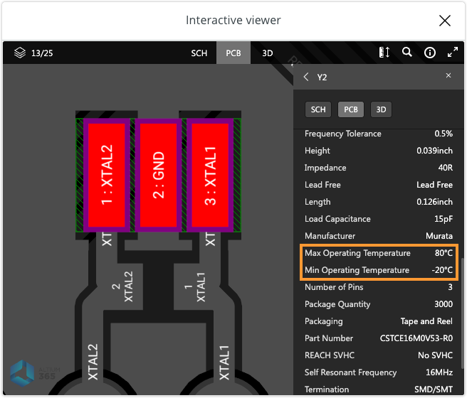

## Temperature

First, some definitions:

* **Ambient temperature:** The temperature of the immediate environment surrounding a device or component when it is powered. Since many of the board's components generate heat to various degree, it will vary depending on where on the board it is being meassured, as well the board's configuration: how much power is being supplied, the microprocessor's load, etc.

* **Operating temperature:** The range of temperatures in which the device or component can operate. This can vary considerable depending on the component: the microcontroller chip can typically substand temperatures much higher than other, more sensitive components on the board.

In [Arduino Docs](https://docs.arduino.cc/), you can find **datasheets** for most boards. These may include the range of "thermal limits" or "operating temperature", which can give you an idea. But even within these ranges sensetive components such as EEPROM, voltage regulators, crystal oscillators, ceramic resonators, and electrolytic capacitors may have reduced lifetime and performance.

| Board                                                                               | Description                                     | Low           | High         |
|-------------------------------------------------------------------------------------|-------------------------------------------------|---------------|--------------|
| [Arduino UNO R3](https://docs.arduino.cc/hardware/uno-rev3)                         | Conservative thermal limits for the whole board | -40°C (-40°F) | 85°C (185°F) |
| [Arduino Nano 33 BLE Sense](https://docs.arduino.cc/hardware/nano-33-ble-sense)     | Conservative thermal limits for the whole board | -40°C (-40°F) | 85°C (185°F) |
| [Arduino Nano RP2040 Connect](https://docs.arduino.cc/hardware/nano-rp2040-connect) | Operating Temperature                           | -20°C (-4°F)  | 80°C (176°F) |

To find temperature ranges for specific components, look for part numbers in the **schematics** or use the **interactive viewer**.

_Viewing the Arduino UNO R3's ceramic resonator._

You can find these resources in Arduino Docs by clicking the **Resources** button.

---

## Humidity

Arduino boards are not tested for humidity, and do not have a stated humidity range. Between 30% RH[^1] and 60% RH (Relative Humidity) is generally considered a safe range for electronics.

[^1]: Relative humidity (RH) is a measure of the absolute vapor content relative to the maximum at the same temperature.

---

## Further reading

* [What power supply can I use with my Arduino board?](https://support.arduino.cc/hc/en-us/articles/360018922259-What-power-supply-can-I-use-with-my-Arduino-board-)
